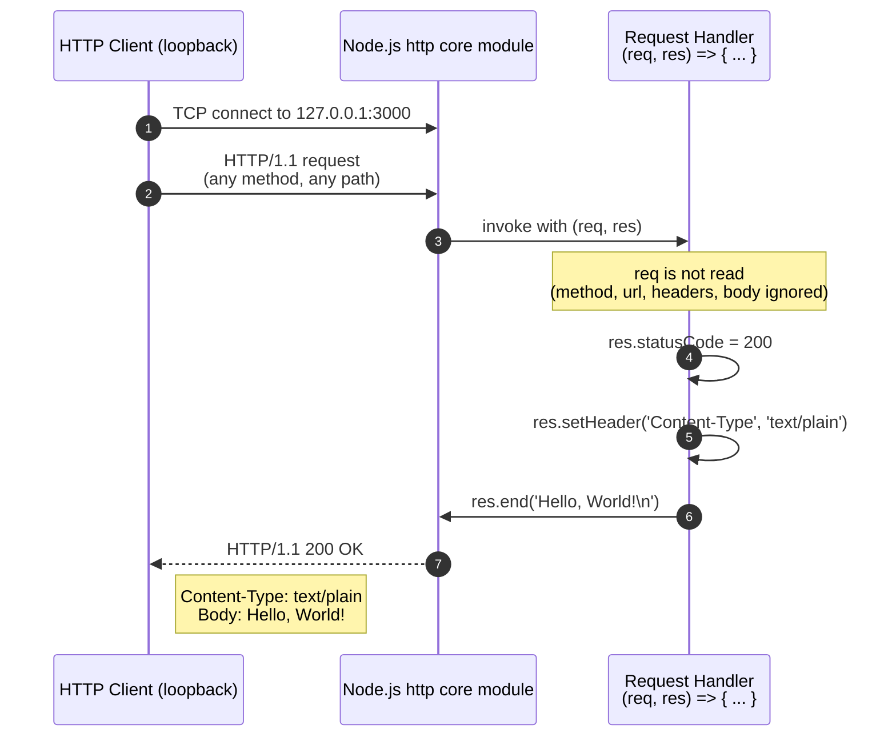

# Hello-World Node.js HTTP Server

This repository contains a single Node.js source file, `server.js`, that runs a
minimal HTTP server. The server returns the literal string `Hello, World!\n` for
every incoming request, regardless of the HTTP method or the request path
(Source: server.js:6–10). It binds to the IPv4 loopback address `127.0.0.1` on
TCP port `3000`, so the listener is reachable only from the same host (Source:
server.js:3–4).

The project's value is **didactic**: it serves as a canonical reference
implementation of the Node.js HTTP-server idiom, suitable for first-time Node
developers, smoke tests of a local environment, and tutorials. It has **zero
third-party dependencies** and uses only the Node.js standard-library `http`
module (Source: server.js:1). For navigation through the rest of this document,
see the Table of Contents below.

## Table of Contents

- [Overview](#overview)
- [Architecture](#architecture)
- [Prerequisites](#prerequisites)
- [Setup Instructions](#setup-instructions)
- [API Documentation](#api-documentation)
- [Configuration](#configuration)
- [Inline Code Explanations](#inline-code-explanations)
- [Deployment Guide](#deployment-guide)
- [Troubleshooting](#troubleshooting)
- [Limitations and Non-Goals](#limitations-and-non-goals)
- [Dependencies](#dependencies)
- [Development](#development)
- [License](#license)

## Overview

This system is a **single-process, single-file, monolithic Node.js script**.
There are no modules beyond the entry-point file, no packages, no build
pipeline, no transpilation, no bundling, and no framework. Execution begins and
ends inside `server.js`; the only runtime artifact loaded outside the file is
the Node.js core `http` module (Source: server.js:1).

**What the server does:** It listens on `127.0.0.1:3000` and responds to every
incoming request with HTTP status `200`, header `Content-Type: text/plain`, and
body `Hello, World!\n` (Source: server.js:6–10). The response is byte-identical
for every request — the handler does not read the request method, URL, headers,
query string, or body.

**What the server does NOT do** (the full enumeration is in [Limitations and Non-Goals](#limitations-and-non-goals)):

- No routing or method dispatch
- No request parsing
- No authentication, TLS, or HTTPS
- No persistence or database
- No logging beyond a single startup line
- No environment-variable or config-file loading
- No graceful shutdown

**Suitable for:** local smoke tests, tutorials, education, and learning the
Node.js `http` API.

**NOT suitable for production:** this implementation has no availability
guarantees, no security hardening, no observability, and no operational tooling.
It must not be deployed for production traffic, public-internet exposure,
multi-tenant scenarios, or anything requiring availability or security
guarantees.

## Architecture

A single Node.js process loads `server.js`, imports the core `http` module,
instantiates exactly one `http.Server` via `http.createServer`, and binds it to
`127.0.0.1:3000` (Source: server.js:1, 3–4, 6, 12). The process is
single-threaded for application logic (it relies on Node's event loop) and
handles incoming requests via an inline anonymous arrow function — the request
handler — passed to `http.createServer`. There are no other components, no
inter-process communication, no worker threads, and no external service
dependencies of any kind.



In plain English: the client opens a TCP connection to the loopback port, the
Node.js `http` core dispatches the parsed HTTP request to the inline request
handler, and the handler ignores `req` entirely while writing a deterministic
response into `res`. Once the handler calls `res.end('Hello, World!\n')`, the
Node.js `http` core writes the response bytes back over the wire and the
connection completes. Because the handler does not branch on any input, every
request follows this same path.

## Prerequisites

The only prerequisite for running this project is a working installation of **Node.js**.

- **Required:** Any Node.js version that supports the standard `http` module —
  effectively, any Node.js release in the past several major lines (Node.js 12
  or later is sufficient).
- **Recommended:** A current LTS release such as Node.js 18 or 20, or any
  actively maintained release.
- **No package manager** (`npm`, `yarn`, `pnpm`) is required at runtime because
  there are zero third-party dependencies.
- **No build step** is required. The script is plain CommonJS JavaScript and
  runs directly under `node`.
- **No environment variables** are read by the script (Source: server.js:1–14).
- **No external services** (databases, caches, message brokers, third-party
  APIs) are required.

To confirm Node.js is installed and available on your `PATH`, run:

```bash
node --version
```

The command must succeed and print a Node.js version string (for example,
`v20.11.0`) before proceeding to the setup instructions. If it fails, see
[Node.js Not Installed](#nodejs-not-installed) under Troubleshooting.

## Setup Instructions

### Acquire the Source

The repository contains exactly one source file (`server.js`). You can acquire
it in either of two ways:

```bash
# Option 1: clone the repository
git clone <repository-url>
cd <repository-name>

# Option 2: download server.js directly from the repository host's web UI
# and save it to any local directory of your choice
```

There are no Git submodules, no Git LFS files, and no companion files to acquire
alongside `server.js`.

### Run the Server

From the directory that contains `server.js`, execute:

```bash
node server.js
```

The command must be run from the directory containing `server.js` (or you may
supply an absolute or relative path to the file). The Node.js process runs in
the **foreground** — the terminal will not return to the prompt until the
process is stopped. Keep the terminal window open for as long as you wish the
server to be available.

### Expected Startup Output

When the server has bound successfully to the configured host and port, exactly
one line is written to standard output:

```text
Server running at http://127.0.0.1:3000/
```

This line is emitted by the listen callback (Source: server.js:13). The absence
of this line within approximately one second of running `node server.js`
indicates a startup failure — see [Troubleshooting](#troubleshooting).

### Verify the Server is Running

In a second terminal (the first terminal is occupied by the running server
process), issue an HTTP request with `curl`:

```bash
curl http://127.0.0.1:3000/
```

The expected response body is exactly:

```text
Hello, World!
```

To inspect the full HTTP response (status line, headers, and body), use the `-i`
flag:

```bash
curl -i http://127.0.0.1:3000/
```

The expected response is:

```text
HTTP/1.1 200 OK
Content-Type: text/plain
Date: <current date>
Connection: keep-alive
Keep-Alive: timeout=5
Content-Length: 14

Hello, World!
```

The exact `Date`, `Connection`, `Keep-Alive`, and `Content-Length` header values
may vary slightly across Node.js versions and request times. The **invariants**
— guaranteed by the source code — are the status line `HTTP/1.1 200 OK`, the
`Content-Type: text/plain` header, and the body `Hello, World!\n` (Source:
server.js:7–9).

### Stopping the Server

The server has **no graceful-shutdown logic**. No `SIGINT` or `SIGTERM` handler
is registered in `server.js`, so termination is immediate and unceremonious.

To stop the server, press `Ctrl+C` in the terminal where the server is running.
This sends `SIGINT` to the Node.js process; the runtime terminates the process
immediately and no cleanup is performed.

On Unix-like systems, you may also stop the server from another terminal by
sending `SIGTERM` with `kill <pid>`, where `<pid>` is the Node.js process ID.
The semantics are the same: the process exits immediately with no cleanup. The
listening socket is released as the OS reclaims the process's resources.

## API Documentation

### Endpoint Reference Table

The server exposes a single conceptual endpoint that responds identically to any
URL path and any HTTP method:

| Attribute | Value |
| :--- | :--- |
| URL | `http://127.0.0.1:3000/<any-path>` |
| HTTP Methods | Any (GET, POST, PUT, DELETE, PATCH, OPTIONS, HEAD, etc.) |
| Path | Any (the path is ignored) |
| Status Code | `200 OK` |
| Response Header | `Content-Type: text/plain` |
| Response Body | `Hello, World!\n` (literal text plus single LF newline) |
| Authentication | None |
| Rate Limiting | None |
| TLS / HTTPS | Not supported (plain HTTP only) |

(Source: server.js:6–10)

### Request / Response Contract

The contract is **deterministic**: the response is byte-identical for every
request, with no dependence on the HTTP method, URL path, query string, request
headers, or request body (Source: server.js:7–9). This is by design — the server
is a static greeter, not a router. Requests with bodies are accepted (Node.js's
`http` core reads them off the socket transparently), but the request handler
never inspects them.

### Sample Request and Response Transcript

The following transcript shows a `GET /` request and the complete response,
including all headers:

**Request:**

```bash
curl -i http://127.0.0.1:3000/
```

**Response:**

```text
HTTP/1.1 200 OK
Content-Type: text/plain
Date: Sun, 01 Jan 2025 00:00:00 GMT
Connection: keep-alive
Keep-Alive: timeout=5
Content-Length: 14

Hello, World!
```

The `Date` header is set automatically by Node's `http` module on every response
and varies with the time at which the response is generated. The
`Content-Length: 14` value corresponds to `len("Hello, World!\n") = 14` bytes
(ten letters — `H`, `e`, `l`, `l`, `o`, `W`, `o`, `r`, `l`, `d` — plus the
comma, the space, the exclamation point, and the trailing newline).

To demonstrate that the response is identical regardless of method or path, the
following alternative request produces the same response body:

**Alternative request (POST with body to a non-existent path):**

```bash
curl -i -X POST http://127.0.0.1:3000/anything --data 'this is ignored'
```

**Alternative response:**

```text
HTTP/1.1 200 OK
Content-Type: text/plain
Date: Sun, 01 Jan 2025 00:00:00 GMT
Connection: keep-alive
Keep-Alive: timeout=5
Content-Length: 14

Hello, World!
```

### Inputs Read by the Handler

**NONE.** The request handler reads no fields of `req` — neither the method, nor
the URL, nor headers, nor body (Source: server.js:6–10). The `req` parameter is
declared by name only because the `http.createServer` callback signature
requires two positional parameters; the value is never accessed inside the
handler body.

This pattern is unusual for production HTTP servers (which typically inspect at
least the method and path) and is a deliberate simplicity choice for a didactic
example. Production servers would read `req.method`, `req.url`, `req.headers`,
and stream `req` to read a request body.

### Outputs Produced by the Handler

The request handler produces exactly three outputs on the response object:

- HTTP status code: `200` set via `res.statusCode = 200;` (Source: server.js:7)
- HTTP response header: `Content-Type: text/plain` set via
  `res.setHeader('Content-Type', 'text/plain');` (Source: server.js:8)
- HTTP response body: `Hello, World!\n` written via `res.end('Hello,
  World!\n');` (Source: server.js:9)

These line numbers correspond to the **original** `server.js` file (before JSDoc
and inline comments were added). If you are reading the post-update `server.js`,
the executable lines appear at different physical line numbers because of
inserted comment blocks, but the executable tokens themselves are byte-for-byte
identical and produce the same output.

## Configuration

All configuration is via **hardcoded literals** in `server.js`. There are no
environment variables, no configuration files, no command-line flags, and no
startup parameters. To change configuration, edit the source file and restart
the process.

| Option | Type | Default | Source Location | Effect of Changing |
| :--- | :--- | :--- | :--- | :--- |
| `hostname` | string | `'127.0.0.1'` | `server.js:3` | Bind address (note 1) |
| `port` | number | `3000` | `server.js:4` | TCP listen port (note 2) |
| Status code | number | `200` | `server.js:7` | HTTP status (every request) |
| Content-Type | string | `'text/plain'` | `server.js:8` | Media-type (note 3) |
| Body | string | `'Hello, World!\n'` | `server.js:9` | Response body (note 4) |

**Detailed effects of changing each option:**

1. **`hostname`** — Changes the bind address. To make the server reachable on
   the local network, change to `'0.0.0.0'` (binds all interfaces) — **not
   recommended for this didactic implementation** because there is no
   authentication or TLS.
2. **`port`** — Changes the TCP port the server listens on. Must be unused on
   the host. Ports below 1024 typically require elevated privileges on
   Unix-like systems.
3. **Response Content-Type** — Changes the media-type advertised in the
   response. The body remains plain text regardless of this header value.
4. **Response body** — Changes the response body. Keep the trailing `\n` for
   clean terminal output when piped through `curl` and similar tools.

**Security note:** Because the bind address is `127.0.0.1` (loopback only), the
server is **not reachable** from other machines on the network or from the
public internet without explicit changes to the source code. This loopback
binding is the de-facto access-control boundary for the running process — there
is no other access control of any kind.

## Inline Code Explanations

This section mirrors the inline comments that have been added to `server.js` in
parallel with this README. It walks through each line of the **original**
14-line `server.js` file in source order, explaining the role of each statement
in plain English.

1. `const http = require('http');` — Imports Node.js's built-in `http` module
   from the standard library (Source: server.js:1). This is the only dependency
   of the script — no third-party packages are used.
2. *(blank line)*
3. `const hostname = '127.0.0.1';` — Declares the bind address (Source:
   server.js:3). `127.0.0.1` is the IPv4 loopback address; binding here means
   the server is reachable only from the same host.
4. `const port = 3000;` — Declares the TCP port to bind (Source: server.js:4).
   The port must be unused on the host at startup, otherwise the listen call
   will fail with `EADDRINUSE`.
5. *(blank line)*
6. `const server = http.createServer((req, res) => {` — Creates a new
   `http.Server` instance and registers an inline anonymous arrow function as
   the request handler (Source: server.js:6). The handler will be invoked once
   per incoming HTTP request.
7. `res.statusCode = 200;` (indented two spaces inside the handler body) — Sets
   the HTTP status code on the response to `200` (OK) (Source: server.js:7).
8. `res.setHeader('Content-Type', 'text/plain');` (indented two spaces inside
   the handler body) — Sets the `Content-Type` response header to `text/plain`,
   declaring that the response body is plain text (Source: server.js:8).
9. `res.end('Hello, World!\n');` (indented two spaces inside the handler body) —
   Writes the response body — the literal string `Hello, World!` plus a trailing
   newline — and signals that no further data will be written, finalizing and
   sending the response (Source: server.js:9).
10. `});` — Closes the request handler and the call to `http.createServer`
    (Source: server.js:10).
11. *(blank line)*
12. `server.listen(port, hostname, () => {` — Activates the server, binding it
    to `${hostname}:${port}`, and registers a one-shot listen callback that
    fires after the bind succeeds (Source: server.js:12).
13. `` console.log(`Server running at http://${hostname}:${port}/`); ``
    (indented two spaces inside the listen callback body) — Writes a single
    readiness line to standard output (Source: server.js:13). This is the
    operator-visible confirmation that the server is up and accepting
    connections.
14. `});` — Closes the listen callback and the call to `server.listen` (Source: server.js:14).

The post-update `server.js` contains a JSDoc file header, JSDoc blocks on every
constant and function, and inline `//` comments on every executable statement
that mirror these explanations directly in the source. Editors with JSDoc
support will surface the annotations on hover.

## Deployment Guide

### Distribution Model

The system is distributed as a **single source file**: `server.js`. There is no
compiled artifact, no package archive (no `.tgz`, no `.zip`), no Docker image,
and no installer.

Distribution is by source-file copy:

- Clone the repository: `git clone <repository-url>` and the file is included.
- Or download `server.js` directly from the repository host's web UI and save it
  to any local directory.

No registry publication, no package-manager publish step, and no artifact-server
upload is performed — the source file itself is the distribution medium.

### Execution Model

Execution is **manual**: an operator runs `node server.js` from a terminal.
There is no service manager (systemd, launchd, Windows Services), no process
supervisor (pm2, supervisord, forever), no container orchestrator, and no CI/CD
pipeline.

The Node.js process runs in the **foreground** in the terminal where it was
started. If the terminal closes, the process is killed and the server stops.
There is no daemon mode, no `nohup` invocation built in, and no detached-process
facility.

For long-running deployments, a service manager would need to be added
externally (for example, by writing a systemd unit file that wraps `node
/path/to/server.js`). This is **out of scope** for the didactic implementation
and is not provided by this repository.

### Reachability and Network Posture

The server binds to `127.0.0.1` (the IPv4 loopback interface only), so it is
reachable **only** from the same host (Source: server.js:3). It is **not**
reachable from:

- Other machines on the same local network (LAN, Wi-Fi, Ethernet)
- VPN clients
- The public internet
- Containers running outside of the host's network namespace

To make the server reachable on the local network, the `hostname` constant in
`server.js` must be changed to `'0.0.0.0'` (which binds all available IPv4
interfaces) or to a specific non-loopback interface address. **This is not
recommended** for the didactic implementation because the server has no
authentication, no TLS, no rate limiting, and no input validation — it is
appropriate only for trusted, controlled environments.

### What Is NOT Provided

The following infrastructure capabilities are explicitly out of scope and are
**not** provided by this repository:

- **CI/CD:** No GitHub Actions workflows, no GitLab CI configuration, no Jenkins
  pipeline, no automated build, no automated tests, no deployment automation.
- **Containerization:** No `Dockerfile`, no `docker-compose.yml`, no published
  container image, no OCI manifest.
- **Orchestration:** No Kubernetes manifests, no Helm chart, no Nomad job
  specification, no Docker Swarm stack file.
- **Cloud Services:** No AWS / GCP / Azure / DigitalOcean / Heroku / Vercel /
  Netlify deployment configuration. No `app.yaml`, no `serverless.yml`, no
  platform-specific manifest.
- **Infrastructure as Code:** No Terraform, no CloudFormation, no Pulumi, no
  Ansible, no Chef, no Puppet.
- **Monitoring / Observability:** No Prometheus metrics, no OpenTelemetry
  tracing, no centralized logging, no health-check endpoint, no readiness probe,
  no liveness probe.
- **Secrets Management:** No environment-variable loading, no secrets vault
  integration, no `.env` file support.
- **Process Management:** No systemd unit file, no pm2 ecosystem file, no
  Windows service definition, no upstart / openrc / sysvinit script.
- **Reverse Proxy / Load Balancer:** No nginx config, no Caddy config, no
  HAProxy config, no Apache `.conf`.

Any of the above can be added as a follow-up if the scope of the project
changes; none is in scope for the didactic reference implementation.

## Troubleshooting

### Port 3000 Already in Use (EADDRINUSE)

**Symptom:** When running `node server.js`, the process exits with an error
containing `EADDRINUSE: address already in use 127.0.0.1:3000`.

**Cause:** Another process on the host is already listening on TCP port 3000.
The Node.js HTTP server cannot bind to a port that is already in use.

**Resolution:** Either stop the other process, or change the port used by this server.

To find the process currently holding port 3000 on Unix-like systems:

```bash
lsof -i :3000
```

Or, alternatively:

```bash
ss -ltnp | grep 3000
```

On Windows (Command Prompt or PowerShell):

```bash
netstat -ano | findstr :3000
```

Once you have identified the conflicting process, either stop it (using its
native shutdown procedure) or change the `port` constant in `server.js` to a
different free port — for example `3001`, `8080`, or `8000` — and re-run `node
server.js`.

### Node.js Not Installed

**Symptom:** Running `node server.js` produces `command not found: node`
(Unix-like systems) or `'node' is not recognized as an internal or external
command, operable program or batch file` (Windows).

**Cause:** Node.js is not installed on the host, or its `node` executable is not
on the system `PATH`.

**Resolution:** Install Node.js from the official Node.js distribution site (the
official Node.js Downloads page). After installation, restart the terminal so
the new `PATH` is picked up, and verify with:

```bash
node --version
```

The command should print a Node.js version string. If it still fails, ensure
that the Node.js installation directory is on your `PATH` environment variable.

### Cannot Reach 127.0.0.1:3000 from Another Host

**Symptom:** A `curl` request from a different machine to
`http://<this-host's-ip>:3000/` times out, or is refused with a
connection-refused error.

**Cause:** This is **expected behavior**, not a defect. The server binds to
`127.0.0.1` (the loopback interface only) and is therefore not reachable from
any other host (Source: server.js:3).

**Resolution:** This is a deliberate design property of the system; the loopback
binding is intentional. If cross-host reachability is required, change the
`hostname` constant in `server.js` to `'0.0.0.0'` (which binds all available
interfaces). **Important:** doing so exposes the server to the local network
without any authentication or encryption. This is appropriate only in fully
trusted environments, and is not recommended for the didactic reference
implementation.

## Limitations and Non-Goals

The following capabilities are **explicitly out of scope** for this
implementation. Each item is a deliberate non-goal, not a defect or oversight:

- **No routing:** Every request, regardless of method or path, receives the same
  response.
- **No request parsing:** The handler does not read the request method, URL,
  query string, headers, or body.
- **No authentication or authorization:** No API keys, no tokens, no sessions,
  no users, no role-based access control.
- **No TLS / HTTPS:** Plain HTTP only. No certificate handling, no SNI, no HSTS.
- **No persistence:** No database connection, no file-system writes, no
  in-memory cache.
- **No environment-variable loading:** All configuration is hardcoded as
  JavaScript literals in `server.js`.
- **No graceful shutdown:** No `SIGINT` or `SIGTERM` handlers; pressing `Ctrl+C`
  terminates the process immediately with no cleanup.
- **No logging beyond startup:** Only a single line is written to stdout, on
  startup. No request logs, no error logs, no access logs, no structured
  logging.
- **No error handling within the handler:** The request handler has no
  `try/catch`; it relies on Node's default uncaught-exception behavior. There is
  no error response path.
- **No multi-tenant capabilities:** A single process serves a single, identical
  response to all callers — no isolation, no tenancy.
- **No tests:** The repository contains no test files, no test framework
  configuration, and no continuous-integration setup.
- **No production-readiness:** This is a didactic reference implementation. It
  is **not suitable for production** deployment.

Adding any of the capabilities above is a deliberate scope expansion that would
change the nature of the project from "didactic reference" to "real server" —
and, accordingly, would warrant its own design and documentation effort.

## Dependencies

This project has **zero third-party dependencies**. The repository contains no
`package.json`, no `package-lock.json`, no `node_modules` directory, no
`yarn.lock`, and no `pnpm-lock.yaml` (Source: server.js — the only `require`
call is for `'http'`, which is a Node.js core module bundled with the runtime).

| Dependency | Type | Source | Notes |
| :--- | :--- | :--- | :--- |
| `http` | Node.js core module | Bundled with Node.js | HTTP server primitives |

The `http` core module provides `http.createServer()`, `http.Server`,
`http.IncomingMessage`, and `http.ServerResponse` — all used (directly or as
parameter types) in `server.js`.

If a future maintainer wishes to install optional documentation tooling — for
example, a JSDoc generator (`jsdoc`) or a Markdown linter (`markdownlint-cli2`)
— they may do so with `npm install --save-dev <package>` after adding a
`package.json` file to the repository. Such tooling is **not required** for the
project to run, and no `package.json` is committed by this work item.

## Development

This section provides guidance for future maintainers wishing to extend or
modify the project.

**Code is annotated.** `server.js` carries a JSDoc file header, JSDoc blocks on
every module-scoped constant and function, and inline `//` comments on every
executable statement. Editors with JSDoc support (VS Code, JetBrains IDEs,
modern Vim or Emacs configurations) will surface the annotations on hover, so
consulting the source directly is the fastest way to understand any individual
line of code.

**Pre-change checklist.** Any change to `server.js` should be accompanied by a
review of the following artifacts to keep documentation synchronized with code:

1. The inline `//` comments inside `server.js`
2. The JSDoc blocks above each declaration in `server.js`
3. This README's [API Documentation](#api-documentation) section (if the
   response shape changes — status code, header, or body)
4. This README's [Configuration](#configuration) section (if any constant
   changes value or is renamed)
5. This README's [Architecture](#architecture) Mermaid diagram (if the
   request/response flow changes)
6. This README's [Inline Code Explanations](#inline-code-explanations) section
   (if any source line is added, removed, or modified)

**Adding tests.** No test framework is currently configured. To add tests,
introduce a `package.json` and choose a framework such as `node:test` (the test
runner built in to Node.js 18 and later), Jest, or Mocha. This is out of scope
for the current work item; the repository remains test-free.

**Generating HTML API documentation from JSDoc.** Optional. The JSDoc blocks in
`server.js` are written to be parseable by JSDoc 4.x. To generate HTML
documentation, a maintainer may run:

```bash
npx jsdoc server.js -d docs/api/
```

This is also out of scope for the current work item; no `jsdoc.json`
configuration file is committed, and the `docs/api/` output directory is not
generated or tracked.

## License

This repository currently does **not** include a `LICENSE` file. In the absence
of an explicit license, the source code is, by default, the property of its
author and is **not** open-source-licensed — it is "all rights reserved" by
default under most jurisdictions' copyright law.

Anyone who wishes to use, modify, or redistribute this code should add a
`LICENSE` file declaring the license of their choice — for example, MIT, Apache
2.0, BSD-3-Clause, or GPL-3.0 — and obtain any necessary permissions from the
author. This README placeholder does not grant or imply any license; it merely
documents the current absence of one.
