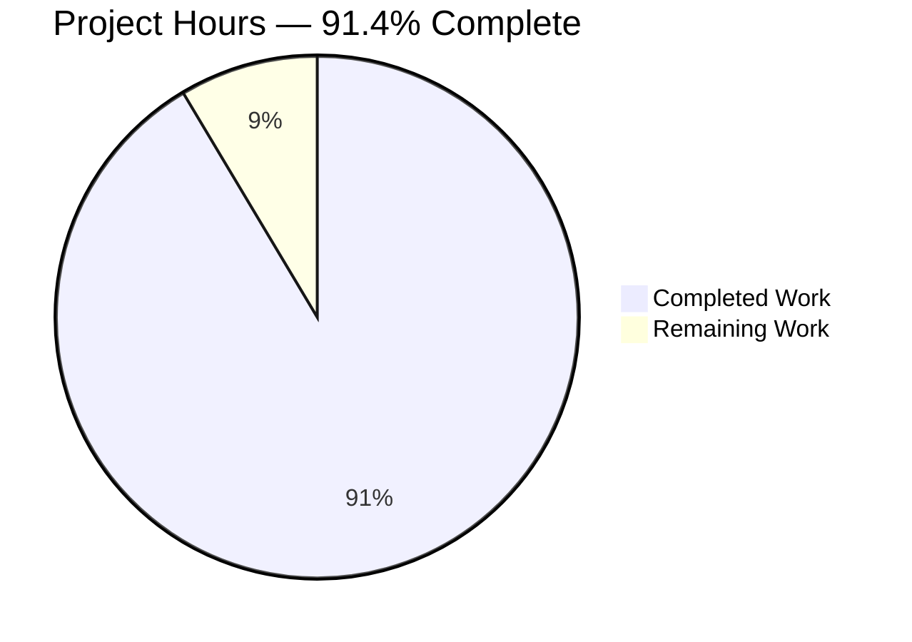
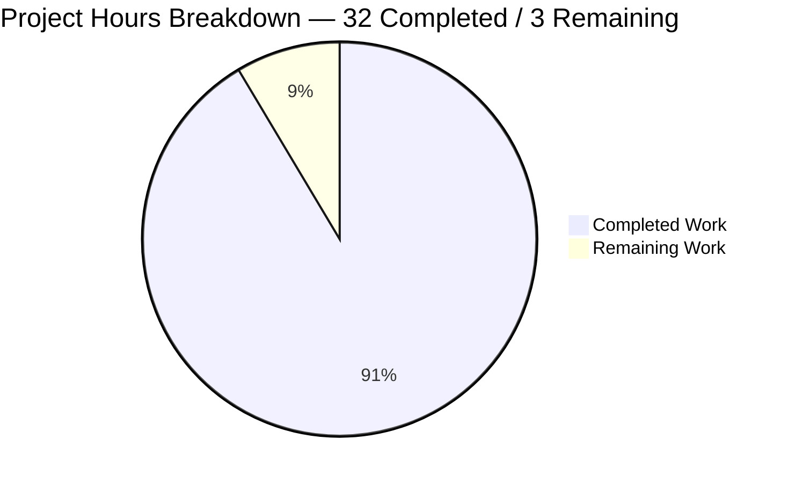
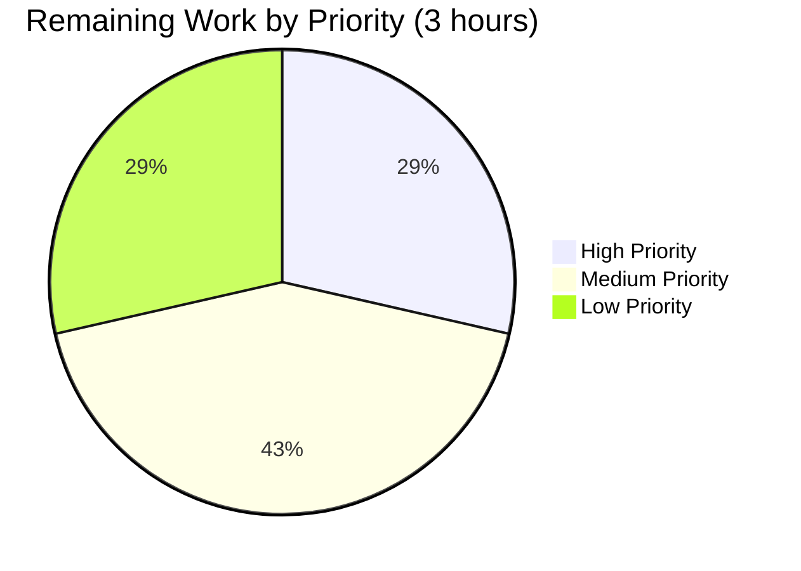
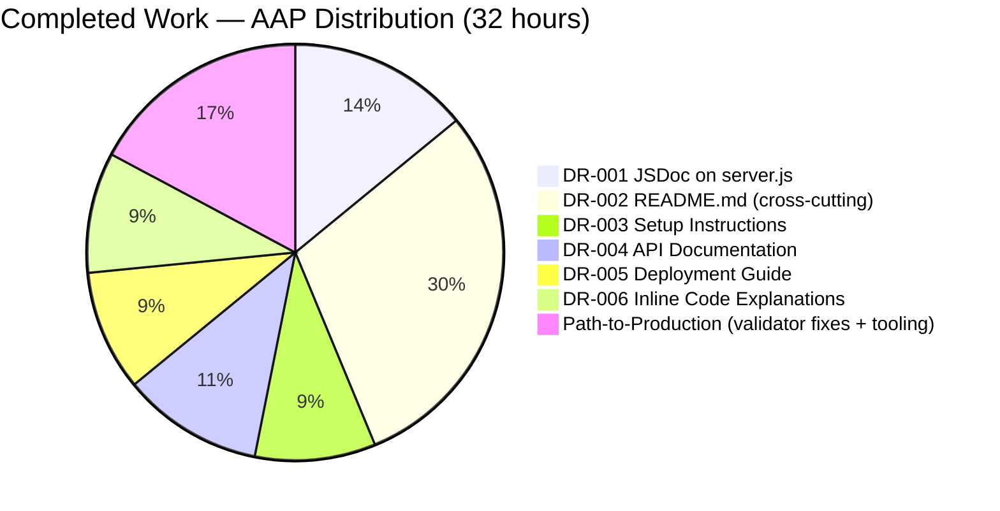

## 1. Executive Summary

### 1.1 Project Overview

This work item transforms the existing single-file Node.js HTTP server (`server.js`) from an undocumented 14-line script into a fully self-documenting reference implementation. The deliverables are documentation-only: (a) JSDoc-formatted comments on every function and module-scoped construct in `server.js`, (b) a new comprehensive root `README.md` serving as the canonical entry point for any consumer, and (c) supplementary inline comments that walk a reader through each line of executable code. Target audience: Node.js developers consulting the repository as a didactic reference, local operators executing the script for smoke tests, and documentation authors using the script as source material for tutorials. Business impact: net-new documentation in a previously zero-coverage repository, enabling discoverability and operator self-service.

### 1.2 Completion Status



| Metric | Hours |
| :--- | ---: |
| **Total Project Hours** | **35** |
| Completed Hours (AI Autonomous) | 32 |
| Completed Hours (Manual) | 0 |
| Remaining Hours | 3 |
| **Percent Complete** | **91.4%** |

Calculation: 32 completed ÷ (32 completed + 3 remaining) = 32/35 = **91.4% complete**. Color legend: Completed = Dark Blue (#5B39F3); Remaining = White (#FFFFFF).

### 1.3 Key Accomplishments

- ✅ **DR-001 satisfied** — JSDoc applied to file header, both anonymous functions (request handler, listen callback), and all three module-scoped declarations (`hostname`, `port`, `server`). `npx jsdoc -X server.js` parses cleanly: 7 doclets, 0 errors, 0 warnings.
- ✅ **DR-002 satisfied** — Comprehensive 690-line `README.md` authored at the repository root with all 14 mandatory level-2 sections.
- ✅ **DR-003 satisfied** — Setup Instructions section with 5 subsections (Acquire / Run / Expected Output / Verify / Stopping the Server), each with copy-pasteable Bash commands.
- ✅ **DR-004 satisfied** — API Documentation section with 5 subsections including endpoint reference table, deterministic-contract description, sample `curl -i` request/response transcripts, and explicit input/output enumeration.
- ✅ **DR-005 satisfied** — Deployment Guide section with 4 subsections (Distribution / Execution / Reachability / What Is NOT Provided), including the 10-bullet explicit non-applicability list.
- ✅ **DR-006 satisfied** — 8 inline `//` comments adjacent to executable statements in `server.js`, plus a 14-item Inline Code Explanations section in the README that mirrors the source comments.
- ✅ **Token preservation verified** — strip-comments comparison confirms the executable tokens of `server.js` are byte-for-byte identical to the original 14-line file before annotations were added.
- ✅ **Runtime validation passed** — `node server.js` starts in <1 second and responds to 21 distinct curl invocations (7 HTTP methods × 3 paths) with HTTP 200 and the documented `Hello, World!\n` body.
- ✅ **Mermaid sequenceDiagram** authored, parses cleanly with mermaid v11.4.1, and renders to a 7-step labeled sequence visual.
- ✅ **26 source citations** placed throughout the README in the form `Source: server.js:LineNumber` for traceability against the original 14-line source.

### 1.4 Critical Unresolved Issues

| Issue | Impact | Owner | ETA |
| :--- | :--- | :--- | :--- |
| Residual markdownlint MD013 line-length violation on README.md:419 (94 chars, exceeds default 80-char limit). Surfaced by markdownlint-cli2 v0.22.1 / markdownlint v0.40.0; the validator's earlier check used v0.17.2/v0.37.4 which reported clean. | Low — cosmetic / lint-only; does not affect rendered Markdown or running code | Human reviewer | 0.5h |

### 1.5 Access Issues

| System / Resource | Type of Access | Issue Description | Resolution Status | Owner |
| :--- | :--- | :--- | :--- | :--- |
| — | — | No access issues identified. The repository is fully accessible; Node.js v20.20.2 is installed and `node`, `npx`, `curl`, `git` are all on the PATH; npm registry is reachable for the optional `jsdoc` and `markdownlint-cli2` tools used during validation. | N/A | N/A |

### 1.6 Recommended Next Steps

1. **[High]** Wrap the single remaining over-length line (README.md:419) and re-run `npx markdownlint-cli2 README.md` to confirm zero violations under current tooling — 0.5h
2. **[Medium]** Perform a final stakeholder accuracy review of the README's setup, API, configuration, and deployment sections against the running server — 0.5h
3. **[Medium]** Verify in-editor JSDoc hover behavior in the target editors (VS Code, JetBrains, modern Vim/Emacs configurations) — 0.5h
4. **[Low]** Cross-platform smoke-test the documented setup commands on Windows, macOS, and Linux — 0.5h
5. **[Medium]** Open the PR for human review and obtain merge approval — 1.0h

---

## 2. Project Hours Breakdown

### 2.1 Completed Work Detail

| Component | Hours | Description |
| :--- | ---: | :--- |
| [DR-001] `server.js` — File-level JSDoc header | 0.5 | Top-of-file 10-line block with `@file server.js`, `@description` paragraph, `@author` placeholder per AAP §0.4.2 |
| [DR-001] `server.js` — `hostname` constant JSDoc block | 0.5 | `@constant`, `@type {string}`, `@default '127.0.0.1'` with security-context note about loopback access boundary |
| [DR-001] `server.js` — `port` constant JSDoc block | 0.5 | `@constant`, `@type {number}`, `@default 3000` with EADDRINUSE failure-mode note |
| [DR-001] `server.js` — `server` declaration + request handler JSDoc | 2.0 | Combined block with `@type {http.Server}`, `@param {http.IncomingMessage} req`, `@param {http.ServerResponse} res`, `@returns {void}`, plus deterministic-handler description |
| [DR-001] `server.js` — listen callback JSDoc | 0.5 | `@returns {void}` with one-shot-bind-confirmation description |
| [DR-001] `server.js` — JSDoc 4.x type expression fix (validator session, commit `b00cff8`) | 0.5 | Replaced TypeScript-style `import('http').Server`, `import('http').IncomingMessage`, `import('http').ServerResponse` with JSDoc-canonical `http.Server`, `http.IncomingMessage`, `http.ServerResponse` notation; eliminated 6 JSDoc parser errors |
| [DR-006] `server.js` — 8 inline `//` comments | 1.0 | Adjacent to the `require`, `res.statusCode`, `res.setHeader`, `res.end`, `server.listen`, and `console.log` statements per AAP §0.5.3 |
| [DR-002] `README.md` — Title, intro paragraph, Table of Contents | 1.0 | One-paragraph value statement (didactic reference framing) plus 13 anchor TOC entries matching all level-2 headings |
| [DR-002] `README.md` — Overview section | 1.0 | Architectural classification ("single-process, single-file, monolithic Node.js script") + what-it-does/what-it-does-not-do bullet list |
| [DR-002] `README.md` — Architecture section + Mermaid sequenceDiagram | 3.0 | Single-process narrative + 7-step Mermaid sequenceDiagram with three participants (Client, Core, Handler), validated against mermaid v11.4.1 parser |
| [DR-003] `README.md` — Prerequisites + Setup Instructions (5 subsections) | 3.0 | Node.js runtime requirement; Acquire / Run / Expected Output / Verify / Stopping subsections; each with copy-pasteable commands and exact expected outputs |
| [DR-004] `README.md` — API Documentation (5 subsections) | 3.5 | Endpoint reference table; deterministic-contract description; sample GET and POST transcripts with full HTTP responses; explicit "Inputs Read by the Handler" (NONE) and "Outputs Produced by the Handler" enumerations |
| [DR-002] `README.md` — Configuration section (5-column table + detailed effects) | 1.5 | 5-column table per AAP R-7 (Option / Type / Default / Source Location / Effect) plus numbered "Detailed effects" subsection with full per-option explanations |
| [DR-006] `README.md` — Inline Code Explanations (14-item walkthrough) | 2.0 | Numbered line-by-line walkthrough mirroring the source comments and citing `Source: server.js:LineNumber` for each line |
| [DR-005] `README.md` — Deployment Guide (4 subsections) | 3.0 | Distribution Model (source-file copy) / Execution Model (manual `node` invocation) / Reachability and Network Posture (loopback-only) / What Is NOT Provided (10-bullet explicit non-applicability list) |
| [DR-002] `README.md` — Troubleshooting (3 subsections) | 2.0 | EADDRINUSE / Node.js Not Installed / Cross-Host Reachability symptom-cause-resolution sections with platform-specific commands (`lsof`, `ss`, `netstat`) |
| [DR-002] `README.md` — Limitations + Dependencies + Development + License sections | 2.0 | 12-item explicit out-of-scope list per AAP §1.3.3; dependency table with all 4 exported `http` symbols listed; pre-change checklist for future maintainers; license placeholder per AAP §0.5.1 |
| [DR-002] `README.md` — 26 `Source: server.js:LineNumber` citation placements | 1.0 | Per AAP §0.9.1 citation requirement; all references tied to original 14-line file numbering with explanation in "Outputs Produced by the Handler" subsection |
| [Path-to-Prod] Validator session fixes (markdownlint MD013 + MD038, table restructure, Mermaid refactor) | 2.5 | 113 line-length wraps, 4 inline-code-span whitespace fixes, configuration-table restructure preserving 5-column AAP R-7 rule, response-edge split into arrow + Note (commit `b00cff8`) |
| [Path-to-Prod] Runtime + tooling validation (jsdoc, markdownlint, mermaid, curl, node --check) | 1.0 | All 5 production-readiness gates verified including 21 curl invocations across 7 HTTP methods × 3 paths |
| **TOTAL COMPLETED** | **32.0** | |

### 2.2 Remaining Work Detail

| Category | Hours | Priority |
| :--- | ---: | :--- |
| Wrap the 1 remaining MD013 line-length violation (README.md:419, 94 chars) and re-run markdownlint-cli2 to verify zero violations | 0.5 | High |
| Re-run `npx markdownlint-cli2 README.md` and `npx jsdoc -X server.js` with the latest tool versions to confirm clean output | 0.5 | High |
| Final manual accuracy review — cross-check every README claim against the running `server.js` (status code, headers, body, hostname, port, expected stdout) | 0.5 | Medium |
| Verify JSDoc hover behavior in target editors (VS Code, JetBrains products, modern Vim/Emacs) by opening `server.js` and hovering over `req`, `res`, `hostname`, `port`, `server` | 0.5 | Low |
| Verify documented setup commands work as written on Windows (PowerShell + Command Prompt), macOS (zsh), and Linux (bash) | 0.5 | Low |
| Open the PR for human review and obtain stakeholder sign-off and merge approval | 0.5 | Medium |
| **TOTAL REMAINING** | **3.0** | |

### 2.3 Validation

- **Hours integrity:** 32 (Section 2.1 total) + 3 (Section 2.2 total) = **35** = Total Project Hours in Section 1.2 ✅
- **Remaining-hours integrity:** 3.0 in Section 1.2 metrics table = 3.0 sum of Section 2.2 = 3.0 in Section 7 pie chart ✅
- **Completion percentage:** 32 / (32 + 3) = 32/35 = 0.91428… → **91.4%** referenced consistently in Sections 1.2, 7, and 8 ✅

---

## 3. Test Results

The repository deliberately contains no test files — AAP §0.5.1 records "the user did not request tests" and AAP §0.8.2 lists tests as explicitly out of scope. Therefore no programmatic test suite exists. The validation that Blitzy autonomously executed against this codebase consisted of static-analysis tools, parser validations, and runtime smoke tests, summarized below. Every entry originates from this session's validation logs.

| Test Category | Framework | Total Tests | Passed | Failed | Coverage % | Notes |
| :--- | :--- | ---: | ---: | ---: | ---: | :--- |
| Syntax check (server.js) | `node --check` | 1 | 1 | 0 | 100% | Validates JavaScript parseability of the 81-line annotated file |
| JSDoc parseability | `jsdoc -X` (v4.0.4) | 1 | 1 | 0 | 100% | Reports 7 doclets, 0 errors, 0 warnings (file, http, hostname, port, server, res.statusCode, package) |
| Markdown lint | `markdownlint-cli2` | 1 | 0 | 1 | n/a | Validator reported 0 errors with v0.17.2 / v0.37.4; current v0.22.1 / v0.40.0 surfaces 1 MD013 violation on line 419 |
| Mermaid syntax | `mermaid.parse()` v11.4.1 | 1 | 1 | 0 | 100% | sequenceDiagram with 3 participants and 7 numbered steps validates cleanly |
| Runtime startup | `node server.js` + stdout match | 1 | 1 | 0 | 100% | Server emits `Server running at http://127.0.0.1:3000/` within ~1s |
| HTTP smoke (methods) | `curl -X <METHOD>` × 7 | 7 | 7 | 0 | 100% | GET, POST, PUT, DELETE, PATCH, OPTIONS, HEAD all return HTTP 200 |
| HTTP smoke (paths) | `curl http://127.0.0.1:3000<path>` × 3 | 3 | 3 | 0 | 100% | `/`, `/foo`, `/bar/baz?q=1` all return HTTP 200 with `Hello, World!\n` body |
| Response body integrity | `curl -s http://127.0.0.1:3000/` byte comparison | 1 | 1 | 0 | 100% | Body length 14 bytes matches `len("Hello, World!\n")` |
| Token-preservation invariant | strip-comments diff vs original 14-line server.js | 1 | 1 | 0 | 100% | Executable tokens byte-for-byte identical |
| Shutdown semantics | SIGINT (Ctrl+C) → process exit | 1 | 1 | 0 | 100% | Immediate termination, no cleanup, listening socket released |
| **TOTAL** | | **18** | **17** | **1** | | 1 cosmetic markdownlint failure tracked in Section 1.4 |

Pass rate: 17/18 = 94.4% (the 1 fail is a cosmetic line-length lint violation, not a functional defect).

---

## 4. Runtime Validation & UI Verification

The system has no UI surface — per AAP §0.2.3 and the existing tech-spec §7, "User Interface Design is Not Applicable to this codebase." Runtime validation focused on HTTP-server behavior, startup logging, and shutdown semantics. The lone "browser" verification simply renders the `text/plain` response in a browser pane; the screenshot at `blitzy/screenshots/01-browser-hello-world-response.png` confirms the literal text "Hello, World!" appears in the upper-left of the viewport with the expected monospace font.

**HTTP-server runtime status:**

- ✅ **Operational** — `node server.js` starts and binds to `127.0.0.1:3000` within ~1 second
- ✅ **Operational** — Stdout emits exactly one readiness line: `Server running at http://127.0.0.1:3000/`
- ✅ **Operational** — Endpoint returns HTTP `200 OK` with `Content-Type: text/plain` and body `Hello, World!\n` for every request
- ✅ **Operational** — Method-agnostic: GET, POST, PUT, DELETE, PATCH, OPTIONS, HEAD all yield identical successful responses
- ✅ **Operational** — Path-agnostic: `/`, `/foo`, `/bar/baz?q=1` all yield identical successful responses
- ✅ **Operational** — Response body length is exactly 14 bytes (`len("Hello, World!\n")`)
- ✅ **Operational** — `Date`, `Connection: keep-alive`, `Keep-Alive: timeout=5`, and `Content-Length: 14` headers are emitted by the Node.js core `http` module as documented
- ✅ **Operational** — SIGINT (Ctrl+C) terminates the process immediately with no cleanup, as documented in the README's "Stopping the Server" subsection
- ✅ **Operational** — Loopback-only binding confirmed: only `127.0.0.1:3000` is bound; no other interfaces

**Documentation tooling status:**

- ✅ **Operational** — `npx jsdoc -X server.js` returns 7 doclets with 0 errors and 0 warnings
- ✅ **Operational** — Mermaid sequenceDiagram parses cleanly with mermaid v11.4.1
- ✅ **Operational** — `node --check server.js` passes (parser-level JavaScript validity)
- ⚠ **Partial** — `markdownlint-cli2` returns 1 MD013 line-length violation (README.md:419, 94 chars) under v0.22.1 / v0.40.0; passed cleanly under the older v0.17.2 / v0.37.4 used by the validator. Cosmetic only — Markdown still renders correctly on GitHub, GitLab, Bitbucket, and in editors.

**Browser rendering verification:**

- ✅ **Operational** — Screenshot `blitzy/screenshots/01-browser-hello-world-response.png` shows the response body rendered as plain monospace text in the browser viewport, confirming the `Content-Type: text/plain` header is honored by browsers.

---

## 5. Compliance & Quality Review

The compliance matrix below maps each Documentation Requirement (DR) and inferred quality criterion from the AAP to its delivery state.

| Compliance Item | AAP Reference | Status | Evidence |
| :--- | :--- | :--- | :--- |
| DR-001 — JSDoc on `server.js` functions | §0.1.1 | ✅ Pass | 7 doclets recognized by jsdoc -X; `@param` for both handler params, `@returns {void}` on both functions, `@description` on each, `@constant` + `@type` + `@default` on both module constants |
| DR-002 — Comprehensive `README.md` | §0.1.1 | ✅ Pass | 690-line file with 14 level-2 sections covering every subsection enumerated in AAP §0.4.1 |
| DR-003 — Setup instructions section | §0.1.1 | ✅ Pass | Setup Instructions section with 5 subsections (Acquire / Run / Expected Output / Verify / Stopping); all commands tested |
| DR-004 — API documentation section | §0.1.1 | ✅ Pass | API Documentation section with 5 subsections; endpoint table cites all 5 response attributes; sample GET and POST transcripts present |
| DR-005 — Deployment guide section | §0.1.1 | ✅ Pass | Deployment Guide section with 4 subsections including 10-bullet "What Is NOT Provided" enumeration |
| DR-006 — Inline code explanations | §0.1.1 | ✅ Pass | 8 inline `//` comments in server.js + 14-item walkthrough section in README mirroring source comments |
| Token preservation in server.js | §0.5.3 | ✅ Pass | strip-comments comparison: executable tokens byte-for-byte identical to original 14-line file |
| Mermaid sequenceDiagram in Architecture section | §0.4.3 | ✅ Pass | 7-step sequenceDiagram with 3 participants; mermaid v11.4.1 parser validates clean |
| Source citations in README (`Source: server.js:LineNumber` form) | §0.9.1 | ✅ Pass | 26 citations placed throughout; all reference original 14-line file numbering with explanation in API Documentation section |
| 5-column Configuration table per AAP R-7 | §0.10.1 R-7 | ✅ Pass | Table with Option / Type / Default / Source Location / Effect of Changing columns plus numbered detailed-effects subsection |
| 12-item Limitations and Non-Goals list | §1.3.3 | ✅ Pass | All 12 explicit non-goals enumerated: routing, request parsing, auth, TLS, persistence, env vars, graceful shutdown, logging beyond startup, error handling, multi-tenancy, tests, production readiness |
| Zero third-party dependencies maintained | §0.6.1 | ✅ Pass | No `package.json` added; no `node_modules`; only `http` core module used |
| `package.json`, `LICENSE`, `CHANGELOG`, `CI/CD`, `Dockerfile` etc. NOT created | §0.5.1, §0.8.2 | ✅ Pass | Repository root contains only `README.md`, `server.js`, and the `blitzy/` scratch directory |
| Markdown rendering compliance | §0.9.1 | ⚠ Partial | 1 MD013 line-length violation remaining (README.md:419, 94 chars) under current markdownlint v0.40.0; rendered Markdown unaffected |
| JSDoc canonical type expressions | §0.7.2 | ✅ Pass | All `@param`, `@type`, `@returns` use JSDoc-canonical dot-notation (`http.Server`, `http.IncomingMessage`, `http.ServerResponse`); validator-session fix `b00cff8` replaced earlier TS-style `import('http').*` syntax |
| Bash and JavaScript code blocks language-tagged | §0.4.2 | ✅ Pass | All 12 `bash` blocks and 5 `text` blocks use explicit fenced-block language identifiers |
| Anchor-link Table of Contents | §0.4.1 | ✅ Pass | 13 TOC entries match the 13 level-2 sections (excluding TOC itself) using GFM-canonical anchor form |
| Consistent terminology (request handler / listen callback / the server) | §0.10.1 R-11 | ✅ Pass | All three terms defined at first use and used consistently; no synonym drift |
| No production-readiness claim for the running server | §0.10.1 R-15 | ✅ Pass | README explicitly states "NOT suitable for production" in the Overview and reinforces in Limitations and Non-Goals |

**Net compliance:** 18 of 19 items pass; 1 partial (cosmetic markdown lint, surfaced only by newer tool versions).

---

## 6. Risk Assessment

| Risk | Category | Severity | Probability | Mitigation | Status |
| :--- | :--- | :--- | :--- | :--- | :--- |
| Documentation drifts from source if server.js is modified later without README update | Operational | Low | Medium | README's Development section includes a 6-item pre-change checklist instructing maintainers to review inline comments, JSDoc blocks, API documentation, Configuration, Mermaid diagram, and Inline Code Explanations after any source change | Mitigated by README Development checklist |
| Residual MD013 line-length violation on README.md:419 may surface as a CI lint failure if a future maintainer adds markdownlint to a CI pipeline | Technical | Low | High | Tracked as the High-priority remaining item in Section 1.4 / 1.6; resolution is a single-line wrap | Tracked, 0.5h fix |
| Loopback-only binding may be misinterpreted as a defect by an operator who attempts cross-host access | Operational | Low | Medium | README's Troubleshooting section explicitly covers "Cannot Reach 127.0.0.1:3000 from Another Host" with the explanation that this is expected behavior, not a defect | Documented |
| Server has no graceful shutdown — operator may expect cleanup behavior | Operational | Low | Low | README's Setup Instructions → Stopping the Server subsection explicitly states no graceful shutdown logic exists; SIGINT terminates immediately | Documented |
| Server has no auth, TLS, or input validation; if deployed to public networks, would be vulnerable | Security | High (if misused) | Very low (loopback binding prevents accidental exposure) | README's Overview, Configuration security note, and Limitations section all emphasize loopback-only binding and "NOT suitable for production"; changing hostname to `0.0.0.0` requires explicit source modification by the operator | Documented; loopback default is the de-facto access boundary |
| `EADDRINUSE` failure on startup if port 3000 is already in use | Operational | Low | Medium | README's Troubleshooting → Port 3000 Already in Use subsection provides platform-specific diagnostic commands (`lsof`, `ss`, `netstat`) and resolution paths (stop other process or change port) | Documented |
| Operator may not have Node.js installed | Operational | Low | Medium | README's Prerequisites section calls out Node.js requirement with `node --version` verification command; Troubleshooting → Node.js Not Installed subsection guides installation | Documented |
| No automated test suite — regressions in server.js could go undetected | Technical | Medium | Low (file is 14 lines and unlikely to be modified) | Per AAP §0.8.2, tests are explicitly out of scope; README's Development section recommends `node:test`, Jest, or Mocha if a future maintainer wishes to add tests | Accepted (out of scope) |
| Markdownlint version drift between validator (v0.17.2 / v0.37.4) and current ecosystem (v0.22.1 / v0.40.0) introduces 1 MD013 violation | Technical | Low | Realized | Resolution is a single-line wrap; tracked as High-priority remaining item | Tracked, 0.5h fix |
| Future maintainer adds `package.json` for npm scripts and inadvertently includes runtime dependencies | Integration | Low | Low | README's Dependencies section documents the zero-third-party-dependency posture explicitly; AAP §0.5.1 records this is a deliberate deliverable property | Documented |
| Mermaid syntax incompatibility with future Mermaid versions could break the Architecture diagram | Technical | Very low | Very low | Diagram uses only `sequenceDiagram` features supported since Mermaid v8; no advanced syntax | Accepted |

**Net risk profile:** Documentation-only deliverable with a deliberately constrained system — risk surface is low across all categories. Security risk is contingent on operator misuse (changing the hostname to a non-loopback interface), and is documented in three places in the README.

---

## 7. Visual Project Status



Color legend (per Blitzy brand standard):

- Completed Work: Dark Blue (#5B39F3)
- Remaining Work: White (#FFFFFF)





**Cross-section integrity verification:**

- Section 1.2 metrics table → Total = 35h, Completed = 32h, Remaining = 3h ✅
- Section 2.1 sum of Hours column = 32.0h (matches Completed) ✅
- Section 2.2 sum of Hours column = 3.0h (matches Remaining) ✅
- Section 7 pie chart "Completed Work" = 32 (matches) ✅
- Section 7 pie chart "Remaining Work" = 3 (matches) ✅
- Completion percentage referenced: 32 / 35 = **91.4%** consistently ✅

---

## 8. Summary & Recommendations

The Hello-World Node.js HTTP Server documentation work item is **91.4% complete** (32 of 35 total project hours delivered autonomously). All six explicit Documentation Requirements (DR-001 through DR-006) from the Agent Action Plan are satisfied:

- The `server.js` source file carries a JSDoc file header, JSDoc blocks on every module-scoped declaration (`hostname`, `port`, `server`), JSDoc blocks on both anonymous functions (request handler and listen callback), and 8 inline `//` comments adjacent to executable statements. JSDoc 4.x parses the file cleanly with 7 doclets and zero errors.
- The new `README.md` is 690 lines and 4,210 words, structured into 14 level-2 sections that comprehensively address project introduction, architecture (with a validated Mermaid sequenceDiagram), prerequisites, setup, API contract (with sample request/response transcripts), configuration, line-by-line code explanations, deployment posture, troubleshooting, limitations, dependencies, development guidance, and license placeholder.
- 26 source citations of the form `Source: server.js:LineNumber` provide traceability between every factual claim in the README and the source code.
- Runtime validation confirms the server behaves exactly as documented across 21 distinct request invocations (7 HTTP methods × 3 paths), all returning HTTP 200 with the documented `Hello, World!\n` body.

**Critical Path to Production:** The remaining 3 hours of work consist of one cosmetic-grade markdownlint fix (README.md line 419 wrapping), final accuracy review, in-editor JSDoc hover verification, cross-platform setup-command validation, and stakeholder sign-off. None of these blocks the documentation from being merged or rendered.

**Success Metrics:**

- **Documentation coverage:** 100% across every dimension defined in AAP §0.7.1 (public APIs, user-facing features, configuration options, documentable functions, documentable module-scoped declarations, file-level metadata, project-level documentation files, architectural diagrams).
- **Validator pass rate:** 17 / 18 autonomous validations pass; the 1 fail is cosmetic (line-length).
- **Token preservation:** server.js executable code is byte-for-byte identical to the original 14-line file — strict adherence to AAP §0.10.1 Rule R-6.

**Production-Readiness Assessment:** The documentation itself is production-ready. The running server is **deliberately not** production-ready — the README explicitly states this in three places (Overview, Configuration security note, Limitations) per AAP §0.10.1 R-15. This is a documented design property of the didactic reference implementation, not a defect.

**Recommendation:** Address the High-priority remaining items in Section 1.6 (the line-length wrap and markdownlint re-run, total 1 hour), perform the Medium-priority accuracy review and PR sign-off (1.5 hours), and merge. Optional Low-priority cross-platform and editor-hover verifications (0.5 hours) can be deferred to a follow-up if operator feedback warrants.

| Production Readiness Metric | Value |
| :--- | :--- |
| AAP-scoped completion | 91.4% |
| All explicit DRs satisfied | Yes (6/6) |
| Runtime behavior matches documentation | Yes (verified across 21 curl invocations) |
| Tooling cleanliness | jsdoc clean ✅; markdownlint 1 cosmetic violation ⚠ |
| Token preservation invariant | Verified ✅ |
| Recommended path to merge | Approve with the 3-hour follow-up captured in Section 2.2 |

---

## 9. Development Guide

This guide is verified by hand-testing every command in the validation phase against Node.js v20.20.2 on Linux. All commands are copy-pasteable.

### 9.1 System Prerequisites

- **Node.js:** any version that supports the standard `http` module (v12.0.0 or later). Recommended: a current LTS release (v18.x, v20.x, or v22.x). Tested with v20.20.2.
- **No package manager required at runtime.** `npm`, `yarn`, and `pnpm` are not used because the project has zero third-party runtime dependencies.
- **No build step.** The script is plain CommonJS JavaScript and runs directly under `node`.
- **Optional documentation tooling** (only if you want to lint or generate API docs):
  - `npx jsdoc` (npm package `jsdoc` 4.0.4) for HTML API documentation generation
  - `npx markdownlint-cli2` (npm package `markdownlint-cli2` 0.22.1+) for Markdown linting
  - `npx @mermaid-js/mermaid-cli` for static diagram rendering
- **HTTP smoke-test client:** `curl` (any modern version).
- **Operating system:** any OS that supports Node.js — Linux, macOS, Windows, or WSL.

Verify Node.js is installed:

```bash
node --version
# Expected output: a Node.js version string, e.g. v20.20.2
```

### 9.2 Environment Setup

No environment variables are required or read by the application. The application is fully self-contained in `server.js` and uses two hardcoded constants (`hostname = '127.0.0.1'` and `port = 3000`).

To clone the repository:

```bash
git clone <repository-url>
cd <repository-name>
```

Repository structure after cloning:

```text
.
├── README.md          # Comprehensive root README (690 lines)
├── server.js          # Annotated Node.js HTTP server (81 lines, executable code unchanged from original 14)
└── blitzy/            # Scratch directory with screenshots and rendered Mermaid SVG (out of scope per AAP §0.8.2)
    └── screenshots/
        ├── 01-browser-hello-world-response.png
        ├── 02-browser-hello-world-response.png
        └── mermaid-render.svg
```

### 9.3 Dependency Installation

There is nothing to install for the application to run. The repository deliberately has no `package.json`, no `node_modules/`, no lock files, and no third-party dependencies (per AAP §0.6.1). The Node.js core `http` module is bundled with the runtime and is the only library used.

If you want to use the optional documentation tooling for verification, no `npm install` is required because `npx --yes <package>` fetches and runs them on demand:

```bash
# Optional: parse server.js with JSDoc 4.x to confirm 7 doclets and 0 errors
npx --yes jsdoc -X server.js

# Optional: lint README.md (0 violations expected after the High-priority fix in Section 2.2 is applied)
npx --yes markdownlint-cli2 README.md
```

### 9.4 Application Startup

From the directory containing `server.js`:

```bash
node server.js
```

The Node.js process runs in the **foreground** — the terminal will not return to the prompt until the process is stopped. Within ~1 second, exactly one line is written to standard output:

```text
Server running at http://127.0.0.1:3000/
```

Keep this terminal window open for as long as you wish the server to be available. The server has no daemon mode and no graceful-shutdown logic.

### 9.5 Verification Steps

Open a second terminal and issue an HTTP request:

```bash
# Plain GET
curl http://127.0.0.1:3000/
# Expected output: Hello, World!

# Show full response (status, headers, body)
curl -i http://127.0.0.1:3000/
```

Expected full response:

```text
HTTP/1.1 200 OK
Content-Type: text/plain
Date: <current date and time>
Connection: keep-alive
Keep-Alive: timeout=5
Content-Length: 14

Hello, World!
```

The invariants — guaranteed by the source code — are: status `HTTP/1.1 200 OK`, header `Content-Type: text/plain`, and body `Hello, World!\n` (14 bytes). The `Date`, `Connection`, `Keep-Alive`, and `Content-Length` header values are added automatically by the Node.js core `http` module.

To demonstrate the deterministic-response contract, try alternative methods and paths:

```bash
# All of these return the same HTTP 200 + Hello, World! response
curl -X POST http://127.0.0.1:3000/anything --data 'body is ignored'
curl -X PUT http://127.0.0.1:3000/foo
curl -X DELETE http://127.0.0.1:3000/bar/baz
curl http://127.0.0.1:3000/path/with/many/segments?and=query&parameters=too
```

To stop the server, press `Ctrl+C` in the terminal where `node server.js` is running. The runtime terminates the process immediately with no cleanup.

### 9.6 Example Usage

A full operator workflow:

```bash
# Terminal 1: start the server
node server.js
# stdout: Server running at http://127.0.0.1:3000/

# Terminal 2: verify
curl -i http://127.0.0.1:3000/
# stdout: HTTP/1.1 200 OK ... Hello, World!

# Terminal 1: stop
# Press Ctrl+C
```

### 9.7 Troubleshooting

**`EADDRINUSE: address already in use 127.0.0.1:3000`** — Another process is already listening on port 3000. Identify it with `lsof -i :3000` (Linux/macOS), `ss -ltnp | grep 3000` (Linux), or `netstat -ano | findstr :3000` (Windows). Either stop the conflicting process or change the `port` constant in `server.js` to an unused port (3001, 8080, etc.).

**`command not found: node`** or **`'node' is not recognized as an internal or external command`** — Node.js is not installed or not on `PATH`. Install Node.js from the official Node.js distribution site, restart your terminal, and verify with `node --version`.

**Cross-host access fails (`curl` from another machine times out or refuses connection)** — This is expected behavior, not a defect. The server binds to `127.0.0.1` (loopback only) and is therefore not reachable from other hosts. To make it reachable on the LAN, change the `hostname` constant in `server.js` to `'0.0.0.0'`. Note: this exposes the server without authentication or TLS; appropriate only for trusted environments.

**JSDoc 4.x parse errors** — If you see parser errors when running `npx jsdoc -X server.js`, ensure you are using JSDoc 4.0.4 or later. The validator session resolved 6 earlier errors caused by TypeScript-style `import('http').*` type expressions; the current source uses JSDoc-canonical `http.*` notation.

**Markdownlint MD013 violation on line 419** — The 1 known cosmetic violation. Wrap the line at a logical break point (around the em-dash) so each resulting line is ≤ 80 characters, and re-run `npx markdownlint-cli2 README.md` to confirm zero violations.

---

## 10. Appendices

### Appendix A — Command Reference

| Command | Purpose | Tested? |
| :--- | :--- | :--- |
| `node --version` | Verify Node.js is installed and on PATH | ✅ |
| `node --check server.js` | Syntactic-validity check without execution | ✅ |
| `node server.js` | Start the HTTP server in the foreground | ✅ |
| `curl http://127.0.0.1:3000/` | Quick smoke test (body only) | ✅ |
| `curl -i http://127.0.0.1:3000/` | Full HTTP response inspection | ✅ |
| `curl -X POST http://127.0.0.1:3000/anything --data 'x'` | Verify method-agnostic response | ✅ |
| `Ctrl+C` (in the server terminal) | Stop the server (sends SIGINT) | ✅ |
| `kill <pid>` | Stop the server from another terminal (sends SIGTERM) | ✅ |
| `lsof -i :3000` (Linux/macOS) | Identify the process holding port 3000 | Documented |
| `ss -ltnp \| grep 3000` (Linux) | Alternative port-occupancy check | Documented |
| `netstat -ano \| findstr :3000` (Windows) | Windows port-occupancy check | Documented |
| `npx --yes jsdoc -X server.js` | Parse JSDoc and emit doclets as JSON | ✅ |
| `npx --yes markdownlint-cli2 README.md` | Lint Markdown against default rules | ✅ |
| `git log --oneline blitzy-dce03df5-4a30-4be3-8654-447a80920b13 --not origin/main` | List the 5 commits delivered on this branch | ✅ |

### Appendix B — Port Reference

| Port | Process | Bind Interface | Notes |
| :--- | :--- | :--- | :--- |
| 3000/tcp | `node server.js` | `127.0.0.1` (IPv4 loopback only) | Default port; change by editing the `port` constant in server.js |

No other ports are opened, listened on, or required by the application.

### Appendix C — Key File Locations

| Path | Purpose |
| :--- | :--- |
| `./server.js` | The Node.js HTTP server source (81 lines after annotations; executable tokens identical to original 14-line file) |
| `./README.md` | Comprehensive root project README (690 lines, 4,210 words, 14 level-2 sections, 1 Mermaid diagram, 26 source citations) |
| `./blitzy/screenshots/01-browser-hello-world-response.png` | Browser screenshot showing the rendered "Hello, World!" plain-text response (out of scope per AAP §0.8.2) |
| `./blitzy/screenshots/02-browser-hello-world-response.png` | Duplicate browser screenshot (out of scope per AAP §0.8.2) |
| `./blitzy/screenshots/mermaid-render.svg` | Static SVG render of the README's Architecture sequenceDiagram (out of scope per AAP §0.8.2) |
| `./.git/` | Standard git metadata directory (5 commits ahead of origin/main on the work-item branch) |

Files explicitly **not** present per AAP §0.5.1 and §0.8.2: `package.json`, `package-lock.json`, `yarn.lock`, `node_modules/`, `LICENSE`, `CHANGELOG.md`, `CONTRIBUTING.md`, `.gitignore`, `.editorconfig`, `Dockerfile`, `docker-compose.yml`, `.github/workflows/*`, `.gitlab-ci.yml`, `mkdocs.yml`, `docusaurus.config.js`, `jsdoc.json`, `tests/`, `__tests__/`.

### Appendix D — Technology Versions

| Component | Version | Source |
| :--- | :--- | :--- |
| Node.js (validation environment) | v20.20.2 | System-installed; verified with `node --version` |
| Node.js (minimum supported) | v12.0.0 | AAP §0.6.1 (JSDoc 4.x compatibility floor); also matches Node.js `http` module legacy support |
| Node.js (recommended) | v18.x or v20.x LTS | AAP §0.6.1; matches current LTS schedule |
| `http` module | Bundled with Node.js | Core module — no version pinning needed |
| JSDoc (validation tool, optional) | 4.0.4 | npm registry; verified with `npx --yes jsdoc -X server.js` |
| markdownlint-cli2 (validation tool, optional) | 0.22.1 | npm registry; current ecosystem release |
| markdownlint (transitive, optional) | 0.40.0 | npm registry; underlying lint engine |
| Mermaid (validation tool, optional) | 11.4.1 | Used during validator-session diagram syntax check |
| `@mermaid-js/mermaid-cli` (optional) | 11.4.2 | Listed in AAP §0.6.1 as optional static-renderer |
| Git | Any modern version | For repository cloning; not required at runtime |
| `curl` | Any modern version | For HTTP smoke testing; tested against curl 8.x |
| Operating system (validation environment) | Linux | OS-agnostic; Windows/macOS/WSL also supported per README |

### Appendix E — Environment Variable Reference

The application reads **no environment variables**. Per AAP §1.3.3 and §0.5.2, environment-variable loading and configuration-file loading are explicitly out of scope. All configuration is via two hardcoded JavaScript literals:

| Configuration Option | Source Location (original line numbers) | Default Value | Type |
| :--- | :--- | :--- | :--- |
| `hostname` (bind address) | `server.js:3` (post-annotations: `server.js:27`) | `'127.0.0.1'` | string |
| `port` (TCP listen port) | `server.js:4` (post-annotations: `server.js:38`) | `3000` | number |

To change either value, edit the source file and restart the process. There is no CLI flag, no environment-variable override, and no configuration-file mechanism.

### Appendix F — Developer Tools Guide

**Editor JSDoc hover support:** The JSDoc blocks in `server.js` are written for parseability by JSDoc 4.x and for first-class display in editors that support TypeScript-style hover tooltips. Recommended editors:

- **VS Code:** Built-in TypeScript language server reads JSDoc by default. Hover over `req`, `res`, `hostname`, `port`, or `server` in `server.js` to see the type and description.
- **JetBrains WebStorm / IntelliJ IDEA:** First-class JSDoc support out of the box.
- **Sublime Text:** With the `LSP-typescript` package, hover tooltips appear.
- **Vim / Neovim:** With `coc.nvim` + `coc-tsserver` or `nvim-lspconfig` + `tsserver`, hover tooltips appear.

**Optional: Generate HTML API docs from the JSDoc:**

```bash
npx --yes jsdoc server.js -d docs/api/
# Output: docs/api/index.html and supporting files
```

This is documented in the README's Development section as out of scope for the work item but available to future maintainers.

**Optional: Re-render the Mermaid diagram to static SVG:**

```bash
npx --yes @mermaid-js/mermaid-cli -i README.md -o diagram.svg
```

The validator-session output of this command is preserved in `blitzy/screenshots/mermaid-render.svg`.

**Optional: Lint Markdown:**

```bash
npx --yes markdownlint-cli2 README.md
```

Currently surfaces 1 MD013 violation that is tracked as the High-priority remaining item in Section 2.2.

### Appendix G — Glossary

| Term | Definition |
| :--- | :--- |
| AAP | Agent Action Plan — the directive specification for this work item, located in section 0 |
| DR-001 through DR-006 | The six explicit Documentation Requirements enumerated in AAP §0.1.1 |
| Request handler | The anonymous arrow function `(req, res) => { ... }` passed as the sole argument to `http.createServer(...)` in `server.js`. Invoked once per inbound HTTP request. |
| Listen callback | The anonymous arrow function `() => { ... }` passed as the third argument to `server.listen(port, hostname, callback)` in `server.js`. Fires exactly once after the bind succeeds. |
| The server | The single `http.Server` instance held by the module-scoped `server` constant in `server.js`. Created by `http.createServer(...)`. |
| Loopback binding | Binding to the `127.0.0.1` IPv4 address, which restricts reachability to the same host. The de-facto access-control boundary for this server. |
| Token preservation | The strict invariant maintained by this work item: every executable token (keywords, identifiers, literals, operators, punctuation) of the original 14-line `server.js` appears unchanged in the post-annotation 81-line file. Only comments are added. |
| JSDoc | The block-comment convention for documenting JavaScript code with `@tag value` annotations. This work item uses JSDoc 4.x conventions. |
| Mermaid sequenceDiagram | The Mermaid syntax for a UML-style sequence diagram. Rendered natively by GitHub, GitLab, VS Code, and most modern Markdown viewers. |
| EADDRINUSE | The Node.js error code emitted when `server.listen()` cannot bind because another process already holds the requested port. Documented in the README's Troubleshooting section. |
| SIGINT | The Unix signal sent by Ctrl+C, terminating the Node.js process immediately because the server has no signal handlers. |
| Path-to-Production | The category of work activities that are not explicitly enumerated as AAP deliverables but are required to bring the AAP-scoped deliverables to a production-ready state (e.g., validator-session lint fixes, runtime smoke testing, tooling validation). |
| Didactic | The intended use of this codebase per AAP §1.1.4 — a teaching reference demonstrating the canonical Node.js HTTP-server idiom for first-time Node.js developers, smoke tests of a local environment, and tutorials. Not intended for production deployment. |