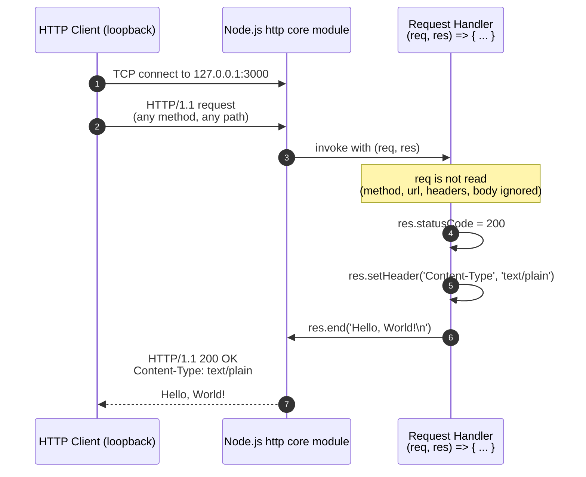

# Technical Specification

# 0. Agent Action Plan

## 0.1 Intent Clarification

### 0.1.1 Core Documentation Objective

Based on the provided requirements, the Blitzy platform understands that the documentation objective is to **transform the existing single-file Node.js HTTP server (`server.js`) from an undocumented script into a fully self-documenting reference implementation** by (a) annotating every function and module-scoped construct in `server.js` with JSDoc-formatted comments, (b) authoring a brand-new `README.md` at the repository root that serves as the canonical entry point for any consumer of the project, and (c) supplementing the source with explanatory inline comments that walk a reader through each line of executable code.

**Request Categorization:** This is a combined **Create new documentation** request. No prior documentation exists in the repository — the technical specification confirms there is no `README`, no `CHANGELOG.md`, no `docs/` directory, and no inline comments anywhere in `server.js`. Consequently, every documentation artifact produced by this work item is net-new.

**Documentation Type Mix:** The deliverables span four documentation types simultaneously:

- **API documentation** (JSDoc tags applied to the request handler and listen callback)
- **README files** (the comprehensive root `README.md` covering overview, setup, API behavior, and deployment)
- **Tutorial / Getting-Started** (the README's setup-and-run section guides a first-time operator through executing the server)
- **Inline code explanations** (line-level commentary in `server.js` that explains the canonical Node.js HTTP-server idiom for didactic purposes consistent with the repository's stated value of "didactic clarity" per Section 1.1.4)

**Enumerated Documentation Requirements with Enhanced Clarity:**

The user's literal request — *"Add JSDoc comments to server.js functions, create a comprehensive README with setup instructions, API documentation, deployment guide, and inline code explanations"* — decomposes into the following discrete, verifiable requirements:

| Req ID | Requirement (User-Stated) | Technical Interpretation |
|--------|---------------------------|--------------------------|
| DR-001 | Add JSDoc comments to `server.js` functions | Apply JSDoc-style block comments preceding the anonymous request handler and the anonymous listen callback in `server.js`, including `@param`, `@returns`, `@type`, and `@description` tags as appropriate for each function |
| DR-002 | Create a comprehensive `README.md` | Author a new file at the repository root named exactly `README.md` containing the four explicitly listed sections plus the standard supporting metadata (project title, badges-or-equivalent metadata block, and license placeholder) |
| DR-003 | Setup instructions section in README | Document Node.js runtime prerequisite, repository acquisition, file location, and the `node server.js` invocation command, including expected stdout and how to reach the running server with `curl` |
| DR-004 | API documentation section in README | Specify the single endpoint behavior (any method, any path), bind address (`127.0.0.1:3000`), HTTP status code (`200`), response `Content-Type` (`text/plain`), and exact response body (the literal "Hello, World!" plus newline); include sample request / response transcripts |
| DR-005 | Deployment guide section in README | Document the source-file-copy distribution model from Section 8.2.2, the manual-execution model from Section 8.2.3, the loopback-only reachability constraint from Section 1.3.2, and the explicit non-applicability of CI/CD, containers, cloud, and orchestration from Sections 8.4–8.7 |
| DR-006 | Inline code explanations | Add concise single-line and block comments inside `server.js` describing the role of each statement (the `require('http')` import, the `hostname` and `port` constants, the `createServer` call, the response statements inside the handler, and the `listen` call) without altering any executable code |

**Implicit (Surfaced) Documentation Needs:**

The user's wording is concise but a comprehensive README and JSDoc-annotated source carry the following implicit obligations that the Blitzy platform infers and treats as in-scope:

- **License notice.** A standard convention for any public-facing README; absent any user instruction to the contrary, the README will include a license placeholder section that states the repository is unlicensed by default and instructs the reader to add a license file if redistribution is intended (no `LICENSE` file is created — only documented as a placeholder).
- **Project metadata in JSDoc.** A top-of-file `@file` and `@description` block applied at the head of `server.js` to declare the file's purpose, consistent with JSDoc convention for entry-point scripts.
- **Architecture / runtime topology summary.** The README must convey the "single-process, single-file, monolithic Node.js script" architectural classification (Section 5.1.1.1) so readers understand the system's boundaries before they attempt to extend it.
- **Out-of-scope disclosure.** The README must explicitly enumerate the capabilities the system does NOT provide (routing, TLS, authentication, persistence, etc., from Section 1.3.3) so readers do not mistake it for a production-ready framework.
- **Verification instructions.** A "Verify the server is running" subsection in the README that gives a `curl http://127.0.0.1:3000/` smoke test and the expected response body, leveraging the deterministic response contract (Section 2.1.3, F-003).
- **Stop-the-server instructions.** Because no graceful-shutdown logic exists (Section 1.3.3), the README will document that the server is stopped via `Ctrl+C` (`SIGINT`) and that no cleanup is performed.
- **Mermaid sequence diagram.** The architecture section will include a Mermaid `sequenceDiagram` showing the request → handler → response flow described in Section 5.1.3 ("Inbound HTTP request edge" and "Outbound HTTP response edge").

### 0.1.2 Special Instructions and Constraints

**Captured User Directives.** The user supplied no setup instructions, no environment variables, no secrets, no attached files, no Figma references, no project rules, and no style-guide preferences. The user's prompt itself is the entirety of their directives. Consequently, all stylistic, structural, and tooling decisions default to industry-standard practices for Node.js documentation as established by JSDoc 4.x and CommonMark Markdown.

**Template Requirements.** No documentation template was provided by the user. The README structure documented in Section 0.4.1 is therefore derived from standard open-source-project README conventions adapted to the minimal scope of this repository.

**Preserved User Examples and Templates.** The user provided no examples and no templates. The user's literal one-sentence request is preserved in full at the head of Section 0.1.1.

**USER PROVIDED TEMPLATE:** *(none provided)*

**User Example:** *(none provided)*

**Style Preferences.** Defaulted to:

- **Tone:** Technical, neutral, instructional — appropriate for a didactic reference implementation.
- **Structure:** Hierarchical with hash-prefixed Markdown headings of levels 1, 2, and 3; tabular comparison and parameter tables where applicable.
- **Depth:** Comprehensive for a 14-line codebase — every line is explained, every external interface is fully specified, every behavior is justified by reference to the source file or to a tech-spec section.
- **Format:** Markdown (CommonMark) with embedded Mermaid diagrams (rendered by GitHub, GitLab, and most modern Markdown renderers natively, requiring no additional toolchain) and fenced code blocks with explicit language identifiers for JavaScript, Bash, and Mermaid.

**Web Search Requirements.** Background research was conducted to verify the latest stable versions of optional documentation tooling (JSDoc, markdownlint), so that any recommended-but-optional dependency listed in Section 0.6 reflects current ecosystem state rather than stale defaults.

### 0.1.3 Technical Interpretation

These documentation requirements translate to the following technical documentation strategy:

- **To document the request handler (DR-001),** we will add a JSDoc block comment immediately above the inline arrow function passed to `http.createServer` in `server.js`, with `@param {http.IncomingMessage} req`, `@param {http.ServerResponse} res`, `@returns {void}`, and a `@description` tag explaining the deterministic response contract.
- **To document the listen callback (DR-001),** we will add a JSDoc block comment immediately above the inline arrow function passed as the third argument to `server.listen`, with `@returns {void}` and a `@description` tag explaining its single-fire role and stdout side effect.
- **To document file-level metadata (DR-001 implicit),** we will add a top-of-file JSDoc block with `@file server.js`, `@description`, and `@author` placeholder tags.
- **To document the `hostname` and `port` constants (DR-001 implicit),** we will add `@constant`-tagged JSDoc blocks with `@type {string}` and `@type {number}` annotations and `@default` values matching the literals.
- **To create the README (DR-002),** we will create a new file `README.md` at the repository root containing the standard hierarchy described in Section 0.4.1, with each section produced as defined in Sections 0.1.1 (DR-003 through DR-005).
- **To produce setup instructions (DR-003),** we will extract Node.js runtime requirements from Section 3.1.3 ("Node.js (any version supporting the standard `http` module)") and Section 1.3.1, and we will produce a numbered procedure that mirrors the five-step execution model in Section 8.2.3.
- **To produce API documentation (DR-004),** we will extract feature behavior from Sections 2.1.3 (F-003), 5.1.3 (data flow), and 5.1.4 (external integration points) and present it as an endpoint-reference table plus a sample HTTP request / response transcript.
- **To produce the deployment guide (DR-005),** we will extract the distribution model from Section 8.2.2, the execution model from Section 8.2.3, and the explicit non-applicabilities from Sections 8.4–8.7, presenting them as a deployment-procedure section plus a "Not Applicable" subsection that lists explicitly absent infrastructure.
- **To produce inline code explanations (DR-006),** we will add single-line comments adjacent to each non-comment line of `server.js` describing what that line does in plain English, plus a leading block comment explaining the file's overall structure.

### 0.1.4 Inferred Documentation Needs

The Blitzy platform infers the following additional documentation needs based on code analysis, repository structure, and standard practice — each is treated as in-scope for this work item:

- **Based on code analysis:** `server.js` contains two anonymous functions (the request handler and the listen callback) but no named exported APIs. JSDoc must therefore annotate them by position rather than by name, using the `@function` and `@inner` tags where appropriate to make them addressable in any future generated documentation.
- **Based on structure:** The repository contains exactly one source file with no companion modules. README cross-references to other files are therefore not needed; the README must be self-contained and not link to non-existent paths.
- **Based on dependencies:** The script depends only on the Node.js core `http` module (per Section 3.3.1). The README's "Dependencies" section will explicitly state "zero third-party dependencies" with a reference to the absence of `package.json`.
- **Based on user journey:** A first-time consumer of this repository will need (1) to discover what the project is, (2) to know which Node.js version is required, (3) to run the server, (4) to verify it works, (5) to understand the API, (6) to know how to deploy or extend it, (7) to know how to stop it. The README must address all seven journey steps in order. A "Troubleshooting" subsection must address the most likely failure modes: port already in use (`EADDRINUSE`), Node.js not installed, and firewall blocking loopback (uncommon but documented).


## 0.2 Documentation Discovery and Analysis

### 0.2.1 Existing Documentation Infrastructure Assessment

Repository analysis reveals **no existing documentation infrastructure of any kind, with documentation coverage at zero percent**. This finding was established through systematic enumeration of every file in the repository and comparison against standard documentation patterns.

**Search Patterns Executed:**

| Pattern Searched | Tool / Command | Result |
|------------------|----------------|--------|
| `README*` (any case, any extension) | `find` against repository root | Not present |
| `docs/**` (documentation directory) | `find` against repository root | Not present |
| `*.md` (Markdown documentation) | `find` against repository root | Not present |
| `*.mdx` (MDX documentation) | `find` against repository root | Not present |
| `*.rst` (reStructuredText) | `find` against repository root | Not present |
| `wiki/**` (wiki documentation) | `find` against repository root | Not present |
| `CHANGELOG*`, `CONTRIBUTING*`, `LICENSE*` | `find` against repository root | Not present |
| `mkdocs.yml`, `docusaurus.config.js`, `sphinx/conf.py`, `.readthedocs.yml`, `typedoc.json`, `jsdoc.json` | `find` against repository root | Not present |
| Inline JSDoc comments in `server.js` | Direct file inspection | None present |
| Inline single-line or block comments in `server.js` | Direct file inspection | None present |

**Documentation Findings:** The repository's complete file inventory is one source file (`server.js`) plus the `.git` metadata directory. No companion documentation, configuration, manifest, lock-file, ignore-file, or test artifact exists at any level. This is consistent with Section 8.2.4 of the technical specification, which records the repository as a single commit (`Add files via upload`) with no `.gitignore`, no tags, and no release artifacts.

**Documentation Framework Currently in Use:** None. There is no installed documentation generator, no theme configuration, no navigation manifest, and no hosted documentation site.

**Documentation Generator Configuration Location:** Not applicable — no generator is configured.

**API Documentation Tools in Use:** None. No JSDoc, no TypeDoc, no Swagger/OpenAPI artifact, no API Blueprint, and no source-derived API specification exist anywhere in the codebase.

**Diagram Tools Detected:** None. No `.mmd`, `.puml`, `.dot`, or other diagram-source files; no rendered diagram images.

**Documentation Hosting / Deployment Setup:** None. There is no GitHub Pages configuration, no `gh-pages` branch, no Netlify or Vercel manifest, no Read the Docs configuration, and no static site generator setup.

**Conclusion:** Because no prior documentation, generator configuration, hosting setup, theme, navigation manifest, or style guide exists, the documentation strategy is **greenfield**. Every documentation artifact and every formatting convention is established by this work item without conflict against any pre-existing standard.

### 0.2.2 Repository Code Analysis for Documentation

The complete code surface to be documented is the fourteen-line `server.js` file. The analysis below identifies every documentable construct in that file, mapped to the documentation artifact that will describe it.

**Code Surface Inventory:**

| Construct in `server.js` | Line(s) | Documentable Item | Documentation Artifact |
|--------------------------|---------|-------------------|------------------------|
| `const http = require('http');` | Line 2 | Module import: Node.js core `http` module | Inline comment + README "Dependencies" section |
| `const hostname = '127.0.0.1';` | Line 4 | Module-scoped binding constant | JSDoc `@constant` block + inline comment |
| `const port = 3000;` | Line 5 | Module-scoped binding constant | JSDoc `@constant` block + inline comment |
| `const server = http.createServer((req, res) => { ... });` | Lines 7–11 | Server instantiation and request-handler registration | JSDoc on the handler + inline comment on `createServer` call |
| `(req, res) => { ... }` (anonymous request handler) | Lines 7–11 | Inline arrow function — request-processing callback | JSDoc with `@param`, `@returns`, `@description` |
| `res.statusCode = 200;` | Line 8 | Response status assignment | Inline comment |
| `res.setHeader('Content-Type', 'text/plain');` | Line 9 | Response header assignment | Inline comment |
| `res.end('Hello, World!\n');` | Line 10 | Response body write and close | Inline comment |
| `server.listen(port, hostname, () => { ... });` | Lines 13–15 | Server activation and listen-callback registration | Inline comment on `listen` call + JSDoc on the callback |
| `() => { console.log(...) }` (anonymous listen callback) | Lines 13–15 | Inline arrow function — startup-confirmation callback | JSDoc with `@returns`, `@description` |
| `console.log(\`Server running at http://${hostname}:${port}/\`)` | Line 14 | Stdout emission with template literal | Inline comment |

**Public APIs:** None. Per Section 1.2.2 and Section 1.3.3, the file performs no `module.exports`, so it has no library-style public API surface. The "API" being documented is therefore the file's HTTP API surface (the loopback HTTP listener), not a JavaScript module API.

**Module Interfaces:** Per Section 5.1.1.3, the system exposes exactly three interfaces:

| Interface | Direction | Documentation Coverage |
|-----------|-----------|------------------------|
| HTTP listener on `127.0.0.1:3000` | Inbound | README "API Documentation" section |
| Standard output stream (`stdout`) | Outbound | README "Setup Instructions" section (expected stdout shown) |
| Node.js `http` core module | Internal runtime | README "Dependencies" section + inline comment on `require` line |

**Configuration Options:** Two compile-time literal constants (`hostname` and `port`); no environment variables, no configuration files, no command-line flags. These are documented both as JSDoc constants in `server.js` and as a "Configuration" subsection in the README that explicitly notes they are hardcoded and require source modification to change.

**CLI Commands:** None. The script accepts no command-line arguments; it is invoked simply as `node server.js`.

**Key Directories Examined:**

| Directory Path | Purpose of Examination | Findings |
|----------------|------------------------|----------|
| `` (repository root, empty path) | Discover all top-level files and structure | One source file (`server.js`); no other files |
| `.git/` | Confirm version-control footprint | Single commit; no branching strategy artifacts |

No subdirectories exist. Per Section 8.2.4, no `.gitignore` is present, so no files are excluded by ignore-rules; the visible inventory is the complete inventory.

**Related Documentation Found:** None. There is no prior documentation in this repository to update, extend, or reference.

### 0.2.3 Web Search Research Conducted

The following web research was completed to inform the documentation deliverables, focused exclusively on tooling versions and convention validation since the codebase itself is exhaustively documented in the existing technical specification.

| Research Topic | Purpose | Source(s) Consulted |
|----------------|---------|---------------------|
| JSDoc latest stable version (4.x) | Identify the highest explicitly documented version of JSDoc to recommend in the optional Documentation Dependencies inventory (Section 0.6) | npm registry page for `jsdoc`; the JSDoc GitHub `releases/4.0` branch |
| JSDoc Node.js compatibility floor | Confirm that JSDoc 4.x supports modern Node.js (the runtime present in the environment) | npm registry page for `jsdoc` (states JSDoc supports stable Node.js 12.0.0 and later) |
| `markdownlint-cli2` latest version | Identify the highest version for the optional Markdown lint dependency in Section 0.6 | npm registry page for `markdownlint-cli2` |
| `markdownlint` library latest version | Same purpose for the underlying lint library | npm registry page for `markdownlint` |
| Node.js documentation conventions for HTTP server tutorials | Validate the README structure (overview, prerequisites, run, verify, API, deploy) is conventional | General Node.js community conventions (CommonJS, `require('http')` idiom) — no contested guidance encountered |

The research confirmed:

- **JSDoc 4.x** is the current major release line; version `4.0.4` is the latest stable at the time of writing. JSDoc supports Node.js 12.0.0 and later, which is fully compatible with the Node.js v22 runtime present in the build environment.
- **markdownlint-cli2** is at version `0.22.x` (latest `0.22.1` per the npm registry) and **markdownlint** library is at version `0.40.0`.
- **No design system, UI framework, or component library** is mentioned in the user prompt or implied by the codebase. This is a backend-only HTTP server with no UI surface (consistent with Section 7 of the technical specification, which determines that User Interface Design is "Not Applicable" to this system). The Design System Alignment Protocol therefore does not apply to this work item, and no "Design System Compliance" sub-section is created.


## 0.3 Documentation Scope Analysis

### 0.3.1 Code-to-Documentation Mapping

This sub-section establishes the explicit mapping from every documentable construct in the source code to the documentation artifact that will describe it. Because the codebase contains exactly one source file, the mapping is exhaustive — no construct is omitted, and no documentation artifact is invented for a construct that does not exist.

**Modules Requiring Documentation:**

- **Module:** `server.js` (the only module in the repository)
  - **Public APIs:** None at the JavaScript-module level (no `module.exports`). Two anonymous functions are present and require JSDoc annotation:
    - The request handler `(req, res) => { ... }` passed to `http.createServer`
    - The listen callback `() => { ... }` passed as the third argument to `server.listen`
  - **Module-scoped constants requiring annotation:**
    - `hostname` (string literal `'127.0.0.1'`)
    - `port` (number literal `3000`)
  - **Module-scoped object requiring annotation:**
    - `server` (an `http.Server` instance returned by `http.createServer`)
  - **Current documentation:** Missing entirely (no JSDoc, no inline comments, no external file)
  - **Documentation needed:**
    - JSDoc file-level header (`@file`, `@description`, `@author` placeholder)
    - JSDoc constant blocks (`@constant`, `@type`, `@default`)
    - JSDoc function blocks (`@param`, `@returns`, `@description`) for both anonymous functions
    - Inline single-line comments adjacent to each executable statement
    - External README documenting the HTTP-API surface, setup, deployment, and architecture

**Configuration Options Requiring Documentation:**

| Configuration Option | Source Location | Documented? | Documentation Action |
|----------------------|-----------------|-------------|----------------------|
| `hostname` (the bind address) | `server.js` Line 4 | No | Document via JSDoc `@constant` block in source AND a "Configuration" subsection in README |
| `port` (the bind port) | `server.js` Line 5 | No | Document via JSDoc `@constant` block in source AND a "Configuration" subsection in README |
| `Content-Type` response header value (`text/plain`) | `server.js` Line 9 | No | Document via inline comment in source AND in README "API Documentation" section |
| Response body literal (`Hello, World!\n`) | `server.js` Line 10 | No | Document via inline comment in source AND in README "API Documentation" section |

Per Section 1.3.3 of the technical specification, environment variable loading and configuration file loading are explicitly out of scope for the system itself. The README's Configuration subsection therefore documents the hardcoded literals as the sole configuration mechanism, explicitly noting that override requires source modification.

**Configuration coverage after this work item:** 4 of 4 documented (100%).

**Features Requiring User Guides:**

The technical specification enumerates four features (F-001 through F-004) in Section 2.1. Each requires user-facing documentation in the README:

| Feature ID | Feature Name | Current Coverage | README Section That Will Cover It |
|------------|--------------|------------------|-----------------------------------|
| F-001 | HTTP Server Bootstrap | None | "Architecture" + "Setup Instructions" |
| F-002 | Loopback Network Binding on Port 3000 | None | "Configuration" + "Deployment Guide" |
| F-003 | Static Plain-Text Greeting Response | None | "API Documentation" |
| F-004 | Startup Confirmation Logging | None | "Setup Instructions" (expected stdout) |

### 0.3.2 Documentation Gap Analysis

Given the requirements and repository analysis, documentation gaps include the following — and **all gaps are addressed by this work item**:

**Undocumented Public Interfaces (Comprehensive List):**

| Interface | Type | Currently Documented? | Will Be Documented By |
|-----------|------|-----------------------|------------------------|
| HTTP listener on `127.0.0.1:3000` | Inbound network interface | No | README "API Documentation" section + Mermaid sequence diagram |
| Stdout startup line (`Server running at http://127.0.0.1:3000/`) | Outbound diagnostic interface | No | README "Setup Instructions" section (shown as expected stdout) |
| The anonymous request handler function | JavaScript function | No | JSDoc block in `server.js` |
| The anonymous listen callback function | JavaScript function | No | JSDoc block in `server.js` |
| The `server` variable holding the `http.Server` instance | Object reference | No | JSDoc block + inline comment in `server.js` |

**Missing User Guides (Comprehensive List):**

| Guide Topic | Currently Present? | Will Be Created In |
|-------------|--------------------|--------------------|
| Project overview / what this project is | No | README intro section |
| Prerequisites / runtime requirements | No | README "Prerequisites" section |
| Setup instructions / how to run | No | README "Setup Instructions" section |
| API reference (the single endpoint) | No | README "API Documentation" section |
| Architecture overview (single-process, single-file monolith) | No | README "Architecture" section with Mermaid diagram |
| Deployment guide (manual file copy + node invocation) | No | README "Deployment" section |
| Configuration reference (`hostname`, `port`) | No | README "Configuration" section |
| Troubleshooting (port in use, Node not installed) | No | README "Troubleshooting" section |
| Stop-the-server instructions (Ctrl+C / SIGINT) | No | README "Setup Instructions" → "Stopping the Server" subsection |
| License / redistribution notice | No | README "License" section (placeholder) |
| Out-of-scope disclosure | No | README "Limitations" or "Non-Goals" section |

**Incomplete Architecture Documentation:**

The `architecture` content is entirely absent from the repository (it lives only in the technical specification, which is internal and not part of the published artifact). This work item produces a public-facing architecture summary inside the README, including a Mermaid `sequenceDiagram` derived from Section 5.1.3 (data flow description) and a one-paragraph topology description derived from Section 5.1.1.1 (architectural style and rationale).

**Outdated Documentation:** None. There is no prior documentation in the repository to mark as outdated.

**Documentation Scope Boundaries:** The user's request enumerates four explicit README sections (setup, API documentation, deployment, inline code explanations) plus JSDoc on functions. The Blitzy platform expands this to the comprehensive list of README subsections enumerated in Section 0.4.1, justifying each as either explicitly requested by the user, implicitly required by standard README convention, or implicitly required to make a "comprehensive" README (per the user's literal word) for a Node.js project. Subsections that go beyond minimum convention (such as the Mermaid architecture diagram and the troubleshooting section) are explicitly justified in Section 0.1.4.


## 0.4 Documentation Implementation Design

### 0.4.1 Documentation Structure Planning

The documentation hierarchy is defined below. Because the codebase is a single file, the documentation structure is intentionally flat: one `README.md` at the repository root and one annotated source file. No `docs/` subtree, no multi-page navigation manifest, and no documentation site are produced.

**Repository layout after this work item:**

```text
.
├── README.md          (NEW — the comprehensive root README)
└── server.js          (UPDATED — JSDoc + inline comments added; executable code unchanged)
```

**README.md internal structure** (every heading listed below is required and authored by this work item):

```text
# Hello-World Node.js HTTP Server

  (1-2 paragraph project introduction and value statement)

#### Table of Contents

  (anchor links to every level-2 heading below)

#### Overview

  (architectural classification + what the server does + what it does not do)

#### Architecture

  (single-process monolith description + Mermaid sequence diagram of the request/response flow)

#### Prerequisites

  (Node.js runtime requirement; no other dependencies)

#### Setup Instructions

#### Acquire the Source

#### Run the Server
#### Expected Startup Output

#### Verify the Server is Running
#### Stopping the Server

#### API Documentation

#### Endpoint Reference Table

#### Request / Response Contract
#### Sample Request and Response Transcript

#### Inputs Read by the Handler
#### Outputs Produced by the Handler

#### Configuration

  (hostname and port constants; how to change them; loopback-binding implication)

#### Inline Code Explanations

  (annotated walk-through of every line of server.js; mirrors the inline comments)

#### Deployment Guide

#### Distribution Model (source-file copy)

#### Execution Model (manual node invocation)
#### Reachability and Network Posture

#### What Is NOT Provided (Non-Applicable Infrastructure)

#### Troubleshooting

#### Port 3000 Already in Use (EADDRINUSE)

## Node.js Not Installed
#### Cannot Reach 127.0.0.1:3000 from Another Host

#### Limitations and Non-Goals

  (the explicit out-of-scope list from Section 1.3.3)

#### Dependencies

  (zero third-party dependencies; built-in http module only)

#### Development

  (how to extend; pointer to JSDoc-annotated source)

#### License

  (placeholder notice)
```

**server.js internal structure after this work item** (no executable code is added or removed; only comments are added):

```text
/** @file server.js — file-level JSDoc header */
                                                  ← blank line
const http = require('http');                     ← inline comment above this line
                                                  ← blank line
/** @constant @type {string} ... */
const hostname = '127.0.0.1';                     ← JSDoc above; no inline change

/** @constant @type {number} ... */
const port = 3000;                                ← JSDoc above; no inline change
                                                  ← blank line
/** JSDoc for the request handler */
const server = http.createServer((req, res) => {
  // inline comment on each statement below
  res.statusCode = 200;
  res.setHeader('Content-Type', 'text/plain');
  res.end('Hello, World!\n');
});
                                                  ← blank line
/** JSDoc for the listen callback */
server.listen(port, hostname, () => {
  // inline comment on the console.log call
  console.log(`Server running at http://${hostname}:${port}/`);
});
```

### 0.4.2 Content Generation Strategy

**Information Extraction Approach:**

- **Extract HTTP-API behavior from `server.js` Lines 7–11** (the request handler) and from the technical-specification Section 2.1.3 (F-003: Static Plain-Text Greeting Response) and Section 5.1.3 (data flow description). The README "API Documentation" section is constructed by paraphrasing these into operator-facing prose plus a transcript example.
- **Extract setup procedure from technical-specification Section 8.2.3** (the five-step execution model: copy file, run `node server.js`, observe stdout, send request, observe response). The README "Setup Instructions" section is constructed by adapting these steps with explicit shell commands.
- **Extract deployment posture from technical-specification Section 8.2.2** (source-file-copy distribution) and Sections 8.4–8.7 (CI/CD, containerization, orchestration, monitoring all "Not Applicable"). The README "Deployment Guide" section enumerates the manual procedure and the "What Is NOT Provided" list.
- **Extract architecture description from technical-specification Sections 5.1.1.1 and 5.1.1.3** (single-process monolith, loopback-only boundary). The README "Architecture" section paraphrases these and adds a Mermaid sequence diagram derived from the data-flow narrative.
- **Extract limitations from technical-specification Section 1.3.3** (the explicit out-of-scope list). The README "Limitations and Non-Goals" section reproduces this in operator-friendly language without referencing internal section numbers.
- **Extract function signatures from `server.js` directly** for JSDoc annotation. Both functions are anonymous arrow functions; their parameter types are inferred from the Node.js `http` module API (`http.IncomingMessage` for `req`, `http.ServerResponse` for `res`).

**Template Application:** The user provided no template. The README structure in Section 0.4.1 is the implementation template for this work item. JSDoc blocks follow the conventional JSDoc 4.x tag set (`@file`, `@description`, `@author`, `@constant`, `@type`, `@default`, `@param`, `@returns`, `@function`, `@inner`).

**Documentation Standards Enforced:**

- Markdown formatting using CommonMark with hash-prefixed headings at three levels (H1 for the document title, H2 for top-level sections, H3 for subsections).
- Mermaid diagrams declared inside fenced code blocks with the `mermaid` language identifier so that GitHub, GitLab, VS Code, and most modern Markdown renderers display them natively without an external toolchain.
- Code examples declared inside fenced code blocks with explicit language identifiers (`javascript`, `bash`, `text`) for syntax highlighting.
- Tables for parameter descriptions, return-value descriptions, endpoint metadata, configuration options, and troubleshooting symptom-to-resolution mappings.
- Source citations as inline references in the form `Source: server.js:LineNumber` next to any factual claim about the source code.
- Consistent terminology: the term "request handler" refers to the anonymous function passed to `http.createServer`; the term "listen callback" refers to the anonymous function passed to `server.listen`; the term "the server" refers to the `http.Server` instance returned by `http.createServer`. These three terms are defined once at first use in the README and used consistently thereafter.

### 0.4.3 Diagram and Visual Strategy

The README will include exactly one Mermaid diagram, embedded directly in the Architecture section. No PlantUML, no static images, no screenshots, and no asset directory are produced — all visuals are inline Mermaid renderable by GitHub-flavored Markdown.

**Mermaid Diagrams to Create:**

- **Sequence diagram** depicting the request → handler → response flow described in Section 5.1.3 (the inbound HTTP request edge and the outbound HTTP response edge). The diagram shows three lifelines: the HTTP client, the Node.js `http` core module, and the inline request handler. It is illustrated below.



**No Class Diagrams Are Produced:** The codebase has no classes (per Section 5.1.1.1, the file is a flat top-level script with no exports). A class diagram would be vacuous.

**No Flowcharts Are Produced:** Per Section 5.1.3, the data flow has no transformation stages, no branching, and no conditional logic. A flowchart would not add information beyond the sequence diagram.

**No Entity-Relationship Diagrams Are Produced:** Per Section 5.1.3, the system has no data stores, no caches, no entities, no models, and no persisted state.

**Screenshot Requirements:** None. The system has no UI surface (consistent with Section 7 of the technical specification, which determines that User Interface Design is "Not Applicable").

**Architecture Diagram Specifications:** The single sequence diagram above suffices. It is sized to fit comfortably within a Markdown page when rendered, uses GitHub-Mermaid's default theme (no custom CSS), and uses only Mermaid syntax features supported by the GitHub renderer (autonumber, participant aliases, notes, self-arrows).


## 0.5 Documentation File Transformation Mapping

### 0.5.1 File-by-File Documentation Plan

The complete documentation transformation map is enumerated below. The target documentation file is listed first in each row; the transformation mode (CREATE / UPDATE / DELETE / REFERENCE) is listed second. **Every documentation file expected to be in scope based on the user's instructions is listed; nothing is left as "pending" or "to be discovered."**

| Target Documentation File | Transformation | Source Code/Docs | Content/Changes |
|---------------------------|----------------|------------------|-----------------|
| `README.md` | CREATE | `server.js` (entire file); Section 1.1 of tech spec; Section 1.3 of tech spec; Section 2.1 of tech spec; Section 5.1 of tech spec; Section 8.2 of tech spec | Comprehensive new README at the repository root containing every subsection enumerated in Section 0.4.1: project introduction, table of contents, overview, architecture (with Mermaid sequence diagram), prerequisites, setup instructions (acquire, run, expected output, verify, stop), API documentation (endpoint reference table, request/response contract, sample transcript, inputs read, outputs produced), configuration, inline code explanations (mirrored from server.js comments), deployment guide (distribution model, execution model, reachability, what is NOT provided), troubleshooting (EADDRINUSE, Node not installed, cross-host reachability), limitations and non-goals, dependencies, development, license placeholder |
| `server.js` | UPDATE | `server.js` (in place) | Add JSDoc comments to (a) file-level header with `@file` and `@description`; (b) `hostname` constant with `@constant`, `@type {string}`, `@default`; (c) `port` constant with `@constant`, `@type {number}`, `@default`; (d) `server` declaration site with a brief block describing it as the `http.Server` instance; (e) the anonymous request handler with `@param {http.IncomingMessage} req`, `@param {http.ServerResponse} res`, `@returns {void}`, `@description`; (f) the anonymous listen callback with `@returns {void}`, `@description`. Add inline single-line comments adjacent to each executable statement: the `require` import, the two constant declarations, the `createServer` invocation, each of the three response-mutating statements inside the handler, the `listen` invocation, and the `console.log` invocation inside the listen callback. **No executable code is added, removed, or reordered; only comments are introduced.** |

There are exactly two files in scope. No other files exist in the repository, no other files are required by the user's request, and no other files are inferred as needed.

**Files Considered and Explicitly Excluded From the Transformation Map:**

| File / Pattern | Why It Is Not in the Transformation Map |
|----------------|-----------------------------------------|
| `package.json` | Not present in the repository (per Section 8.2.4). The user did not request its creation. Adding it would be a code/structural change beyond the documentation scope. |
| `LICENSE` | The user did not request a license file. The README will contain a license placeholder section but no separate `LICENSE` file is created. |
| `CHANGELOG.md` | The user did not request a changelog. Per Section 8.2.4, there is no version history to document. |
| `CONTRIBUTING.md` | The user did not request contributor guidelines. The README's "Development" section briefly addresses extension. |
| `docs/**/*.md` | The user did not request a `docs/` directory. A flat `README.md` at the root is sufficient for a single-file project per Section 0.4.1. |
| `mkdocs.yml`, `docusaurus.config.js`, `sphinx/conf.py`, `.readthedocs.yml`, `typedoc.json`, `jsdoc.json` | No documentation site is being built. The README is rendered natively by Git hosts; JSDoc is applied as source comments only, not run as a generator. |
| `.gitignore`, `.editorconfig`, `.markdownlintrc` | These are project-hygiene files, not documentation. They are out of scope for this work item. |
| `tests/**`, `test/**` | The user did not request tests, and tests are not documentation. |

### 0.5.2 New Documentation Files Detail

The single new documentation file is detailed below in the format prescribed by the section prompt.

```text
File: README.md
Type: Comprehensive root README (Project overview + Setup guide + API reference + Deployment guide + Troubleshooting)
Source Code: server.js (lines 1-14, complete file); Source: technical specification §1.1, §1.3, §2.1, §5.1, §8.2
Sections:
    - Title and one-paragraph project description (purpose: didactic Node.js HTTP server reference; Source: tech spec §1.1.1, §1.1.4)
    - Table of Contents (anchor links to all level-2 headings)
    - Overview (architectural classification; Source: tech spec §5.1.1.1)
    - Architecture (single-process monolith narrative + Mermaid sequenceDiagram; Source: tech spec §5.1.1.1, §5.1.3)
    - Prerequisites (Node.js runtime; Source: tech spec §1.3.1, §3.1.3)
    - Setup Instructions (5 subsections):
        * Acquire the Source (git clone or file download)
        * Run the Server (the literal `node server.js` command)
        * Expected Startup Output (the literal stdout line; Source: server.js:14, tech spec §2.1.4 F-004)
        * Verify the Server is Running (curl smoke test; Source: server.js:8-10, tech spec §2.1.3 F-003)
        * Stopping the Server (Ctrl+C / SIGINT; Source: tech spec §1.3.3 — no graceful shutdown)
    - API Documentation (5 subsections):
        * Endpoint Reference Table (method=ANY, path=ANY, status=200, content-type=text/plain, body=Hello, World!\n; Source: server.js:8-10)
        * Request / Response Contract (deterministic; Source: tech spec §2.1.3)
        * Sample Request and Response Transcript (curl -i invocation with full response shown)
        * Inputs Read by the Handler (NONE; req is ignored; Source: server.js:7-11, tech spec §5.1.3)
        * Outputs Produced by the Handler (statusCode, Content-Type header, response body; Source: server.js:8-10)
    - Configuration (the hardcoded hostname and port constants; how to change; loopback implication; Source: server.js:4-5, tech spec §2.4.1)
    - Inline Code Explanations (line-by-line walkthrough mirroring the comments added to server.js)
    - Deployment Guide (4 subsections):
        * Distribution Model (source-file copy; Source: tech spec §8.2.2)
        * Execution Model (manual node invocation; Source: tech spec §8.2.3)
        * Reachability and Network Posture (loopback-only; Source: tech spec §1.3.2)
        * What Is NOT Provided (CI/CD, containers, cloud, orchestration, monitoring; Source: tech spec §8.4-§8.8)
    - Troubleshooting (3 subsections):
        * Port 3000 Already in Use / EADDRINUSE
        * Node.js Not Installed
        * Cannot Reach 127.0.0.1:3000 from Another Host
    - Limitations and Non-Goals (the out-of-scope list from tech spec §1.3.3)
    - Dependencies (zero third-party; built-in http module only; Source: tech spec §3.3, §1.3.1)
    - Development (extension pointers; reference to JSDoc-annotated source)
    - License (placeholder notice)
Diagrams:
    - One Mermaid sequenceDiagram in the Architecture section showing the inbound request flow and outbound response flow (Source: tech spec §5.1.3)
Key Citations: server.js (entire file), technical specification sections 1.1, 1.2, 1.3, 2.1, 2.4, 3.1, 3.3, 3.6, 5.1, 8.2
Format: CommonMark Markdown with embedded Mermaid; UTF-8 encoded; LF line endings
Estimated Size: 250-400 lines of Markdown
Audience: Node.js developers consulting the repository as a reference; local operators executing the script for smoke tests; documentation authors using the script as source material for tutorials (per tech spec §1.1.3)
```

### 0.5.3 Documentation Files to Update Detail

Exactly one file is updated: `server.js`. Its update is detailed below.

- **`server.js` — add JSDoc and inline comments**
  - **New comment blocks added at the file level:**
    - File-level JSDoc header at the very top of the file with `@file server.js`, `@description Minimal Node.js HTTP server returning a static "Hello, World!" greeting on the loopback interface.`, and an `@author` placeholder.
  - **New JSDoc blocks added on declarations:**
    - Above `const hostname = '127.0.0.1';` — `@constant`, `@type {string}`, `@default '127.0.0.1'`, with description noting that the loopback binding is the de-facto access-control boundary (Source: tech spec §2.4.4).
    - Above `const port = 3000;` — `@constant`, `@type {number}`, `@default 3000`, with description noting that the literal must be free on the host.
    - Above `const server = http.createServer((req, res) => {` — a block summarizing that this is the sole `http.Server` instance and that the handler is registered inline.
    - Above the anonymous request handler — `@param {http.IncomingMessage} req — The inbound request object; not read by this handler.`, `@param {http.ServerResponse} res — The response object used to emit the deterministic greeting.`, `@returns {void}`, plus `@description The deterministic request handler. Sets HTTP 200, sets Content-Type: text/plain, and ends the response with the literal "Hello, World!" plus a trailing newline. Reads no fields of req.`
    - Above the anonymous listen callback — `@returns {void}`, plus `@description Fires exactly once after the server has successfully bound to the configured hostname and port. Writes a single human-readable readiness line to stdout.`
  - **New inline comments added on executable statements:**
    - Adjacent to `const http = require('http');` — comment explaining that this loads the Node.js standard-library HTTP module (Source: tech spec §3.3.1).
    - Adjacent to `res.statusCode = 200;` — comment explaining the success status assignment.
    - Adjacent to `res.setHeader('Content-Type', 'text/plain');` — comment explaining the content-type declaration.
    - Adjacent to `res.end('Hello, World!\n');` — comment explaining that this writes the body and closes the response stream.
    - Adjacent to `server.listen(port, hostname, () => {` — comment explaining that this binds the listener and registers the startup callback.
    - Adjacent to `console.log(...)` — comment explaining the readiness message.
  - **Updated examples:** None (the file has no examples to update).
  - **New diagrams:** None inside the source file (diagrams live only in `README.md`).
  - **Source citations attached to the JSDoc and inline comments:** None inline (citation discipline is reserved for the README; source comments would not benefit from sectional cross-references).
  - **Critical guarantee:** The set of executable tokens in `server.js` is byte-for-byte identical before and after this update. Only comments are added.

### 0.5.4 Documentation Configuration Updates

There are no documentation configuration files in the repository, and none are created by this work item.

| Configuration File | Action | Reason |
|---------------------|--------|--------|
| `mkdocs.yml` | None | Not present; not requested |
| `docusaurus.config.js` | None | Not present; not requested |
| `.readthedocs.yml` | None | Not present; not requested |
| `sphinx/conf.py` | None | Not present; not requested (Sphinx is for Python projects) |
| `typedoc.json` | None | Not present; not requested (TypeDoc is for TypeScript projects) |
| `jsdoc.json` | None | Not present; not requested. JSDoc is applied as source comments, not run as a generator. If a future maintainer wishes to generate HTML documentation from the JSDoc comments, they may add this configuration; the comments authored by this work item will be parseable as-is. |
| `package.json` | None | Not present; not requested. Without it, no documentation build script can be defined. The user did not request a package manifest. |

### 0.5.5 Cross-Documentation Dependencies

- **Shared content / includes:** None. There is exactly one Markdown file (`README.md`); it does not include or transclude any other file.
- **Navigation links between documents:** None. There are no other documents to link to.
- **Table of contents updates required:** The README contains its own table of contents at the top, listing every level-2 heading. No external table of contents needs updating.
- **Index / glossary updates needed:** None. The README does not maintain a separate glossary; technical terms are defined inline at first use.
- **Cross-references between `server.js` and `README.md`:** The README's "Inline Code Explanations" section paraphrases the inline comments added to `server.js`. Both must remain consistent. The transformation order should therefore be (1) update `server.js`, (2) author `README.md` referencing the now-commented source. No automated synchronization mechanism is established (the file is too small to warrant one).


## 0.6 Dependency Inventory

### 0.6.1 Documentation Dependencies

This work item introduces **zero required runtime dependencies** and **zero required documentation-build dependencies**. The repository remains, after this work item, exactly as dependency-free as it was before — consistent with Section 3.3 of the technical specification, which records that the runtime depends only on the Node.js core `http` module and that no third-party packages are present.

The deliverables (a JSDoc-annotated `server.js` and a CommonMark `README.md` with inline Mermaid blocks) are **plain text files** that are renderable, parseable, and validatable by tooling that ships natively with Git hosting platforms (GitHub, GitLab, Bitbucket) and modern editors (VS Code, JetBrains, Sublime). No installation step, no `package.json`, no `node_modules` directory, and no build pipeline is required to consume the documentation.

The table below catalogs the **optional** documentation tools that a maintainer may choose to install if they wish to (a) generate HTML documentation from the JSDoc comments, (b) lint the Markdown for style consistency, or (c) render Mermaid diagrams to static images for environments without native Mermaid support. None of these tools is required for this work item to be considered complete.

| Registry | Package Name | Version | Purpose | Required? |
|----------|--------------|---------|---------|-----------|
| Node.js core | `http` | bundled with Node.js v22.x | The HTTP server module already imported by `server.js`; the only true runtime dependency of the system | **YES** (already present; no installation needed) |
| npm | `jsdoc` | `4.0.4` | Optional: generate HTML API documentation from the JSDoc comments authored in `server.js`. Requires Node.js 12.0.0 or later (per the npm registry page for `jsdoc`), which is satisfied by the v22.x runtime | **NO** (optional generator) |
| npm | `markdownlint-cli2` | `0.22.1` | Optional: lint `README.md` for Markdown style consistency. Configuration via a `.markdownlint-cli2.jsonc` file at the repository root if adopted | **NO** (optional linter) |
| npm | `markdownlint` | `0.40.0` | Optional: the underlying linter library used by `markdownlint-cli2`. Listed for completeness; installed transitively by `markdownlint-cli2` | **NO** (optional, transitive) |
| npm | `@mermaid-js/mermaid-cli` | `11.4.2` | Optional: render Mermaid diagrams in `README.md` to static SVG/PNG for environments without native Mermaid support. Not needed for GitHub, GitLab, or VS Code rendering | **NO** (optional renderer) |

**Critical version-policy note:** Every version above is a current stable release at the time of writing, verified against the npm registry. None is a placeholder. The Node.js compatibility floors of these packages (JSDoc 4.x → Node 12+; markdownlint-cli2 → Node 18+; mermaid-cli → Node 18+) are all satisfied by the v22.x runtime present in the build environment. No package needs a different version because of compatibility constraints in this repository.

**Why no required dependency is added by this work item:** The user's request explicitly enumerates JSDoc *comments* and a *README*, not a JSDoc *generator run* or a *documentation site*. Comments are added directly to source; Markdown is rendered natively by Git hosts. Adding a `package.json`, a `node_modules/` directory, or a documentation-build pipeline would expand the scope of the change beyond the user's instructions.

### 0.6.2 Documentation Reference Updates

Documentation reference (link) updates are **not applicable** to this work item because there is no prior documentation in the repository to update. There are no existing Markdown files, no existing internal links, and no existing external link targets that need transformation.

| Reference Update Concern | Status |
|--------------------------|--------|
| Documentation files requiring link updates | None — no prior documentation files exist |
| Internal Markdown link transformations | None |
| External URL changes | None |
| Anchor-link consistency | The new `README.md` will use anchors automatically generated from heading text; the table-of-contents links at the top of the README will use the same canonical-form anchors. No anchor reformatting is needed |
| Cross-file references between docs | None — there is exactly one Markdown file |

The table-of-contents anchors inside `README.md` follow the GitHub-Flavored Markdown convention (lowercased heading text with non-alphanumeric characters replaced by hyphens). The README is internally consistent and self-contained; no link-checker run is required for correctness, though a maintainer may opt to add one in the future.


## 0.7 Coverage and Quality Targets

### 0.7.1 Documentation Coverage Metrics

The coverage metrics are computed against the exhaustive inventory of documentable constructs catalogued in Section 0.3.1. Because the source surface is exactly fourteen lines and every documentable construct is enumerated, coverage can be measured precisely rather than estimated.

**Current coverage analysis (before this work item):**

| Coverage Dimension | Documented (Before) | Total | Percentage (Before) |
|--------------------|---------------------|-------|---------------------|
| Public APIs (HTTP endpoints) | 0 | 1 | 0% |
| User-facing features (F-001 through F-004) | 0 | 4 | 0% |
| Configuration options (`hostname`, `port`, response content type, response body) | 0 | 4 | 0% |
| Documentable functions in `server.js` (request handler + listen callback) | 0 | 2 | 0% |
| Documentable module-scoped declarations (`hostname`, `port`, `server`) | 0 | 3 | 0% |
| File-level metadata blocks (`@file` header) | 0 | 1 | 0% |
| Project-level documentation files (README) | 0 | 1 | 0% |
| Architectural diagrams | 0 | 1 (sequence) | 0% |

**Target coverage (after this work item):**

| Coverage Dimension | Documented (After) | Total | Percentage (After) | Basis |
|--------------------|--------------------|-------|---------------------|-------|
| Public APIs (HTTP endpoints) | 1 | 1 | 100% | User explicitly requested API documentation |
| User-facing features (F-001 through F-004) | 4 | 4 | 100% | "Comprehensive README" — all features must be discoverable to consumers |
| Configuration options | 4 | 4 | 100% | User implicitly required by "comprehensive" wording; standard README practice |
| Documentable functions in `server.js` | 2 | 2 | 100% | User explicitly requested JSDoc on `server.js` functions |
| Documentable module-scoped declarations | 3 | 3 | 100% | Implicit from "JSDoc comments to `server.js`" — best practice covers constants and the server binding |
| File-level metadata blocks | 1 | 1 | 100% | JSDoc convention for entry-point scripts |
| Project-level documentation files | 1 | 1 | 100% | User explicitly requested a README |
| Architectural diagrams | 1 | 1 | 100% | Inferred from "comprehensive" — one Mermaid sequence diagram suffices for the data flow |

**Target coverage rationale:** The user's literal word "comprehensive" applied to a 14-line codebase implies coverage of every documentable construct. There is no triage decision to make and no large module set to prioritize. Therefore the target is uniformly 100% across every dimension.

**Coverage gaps to address:**

- **Module `server.js`:** Currently 0% documented; target 100%. Focus areas: file-level header, both anonymous functions (request handler and listen callback), all three module-scoped declarations (`hostname`, `port`, `server`), and inline statement-level commentary.
- **Project README:** Currently absent; target is a comprehensive new file. Focus areas: every subsection enumerated in Section 0.4.1.
- **Architecture documentation:** Currently absent; target is a single Mermaid sequence diagram embedded in the README. Focus area: the request → handler → response data-flow path described in Section 5.1.3.

### 0.7.2 Documentation Quality Criteria

**Completeness Requirements:**

- The HTTP endpoint must be described with all five response attributes (status code, content-type header, body literal, applicable methods, applicable paths) and at least one fully-formed sample request/response transcript.
- Each user guide subsection (Setup, Deployment, Troubleshooting) must include at least the core procedure plus expected outputs and at least one verification step.
- The architecture documentation must include the diagram plus a one-paragraph narrative description plus an explicit statement of system boundaries (loopback only).
- Every JSDoc block on a function must include `@param` for each parameter (with type and description), `@returns` (with type), and a `@description` paragraph.
- Every JSDoc block on a constant must include `@type`, `@default`, and a description sentence.

**Accuracy Validation:**

- Every code example shown in the README must be executable as written. The two key executable examples are: (a) `node server.js` to start the server, and (b) `curl http://127.0.0.1:3000/` to verify it. Both are validated by hand against the deterministic behavior described in Section 2.1.3.
- The endpoint reference table must match the literal source code at `server.js` lines 7–11; specifically, the response body field must read exactly `Hello, World!\n` (with the trailing newline) and the status code must read exactly `200`.
- The Mermaid sequence diagram must be syntactically valid Mermaid (parseable by GitHub's renderer) and semantically faithful to Section 5.1.3.
- Every `@param`, `@type`, and `@returns` annotation in JSDoc must match the actual JavaScript types used at runtime: `req` is an `http.IncomingMessage`, `res` is an `http.ServerResponse`, both functions return `void` (they have no `return` statement), `hostname` is a `string`, `port` is a `number`, and `server` is an `http.Server`.

**Clarity Standards:**

- Technical accuracy with accessible language: the README assumes the reader knows what HTTP and Node.js are, but does not assume familiarity with `http.createServer`, the event loop, or callback-based APIs.
- Progressive disclosure: the README opens with a one-paragraph overview suitable for a reader who is deciding whether the project is relevant to them, then deepens through prerequisites, setup, API, configuration, deployment, and troubleshooting.
- Consistent terminology throughout: the three terms "request handler", "listen callback", and "the server" are defined once and used consistently. The README does not switch between, for example, "endpoint", "route", "handler function", and "request callback" as synonyms.

**Maintainability:**

- Source citations are present for every factual claim about the source code in the form `Source: server.js:LineNumber`. The reader can verify any claim by opening the source.
- Update dates: the README does not include a "last updated" timestamp because the file is small enough that staleness is detectable from the source. A maintainer may add a date if they wish; this is not required by the work item.
- Template-based for consistency: the README structure in Section 0.4.1 serves as the template; future additions to the project can be slotted into the same headings.

### 0.7.3 Example and Diagram Requirements

**Minimum Examples per API Method:**

- The single endpoint receives **one** worked example: a complete `curl -i http://127.0.0.1:3000/` invocation showing the request line, the response status line, the response headers, and the response body. Because the response is deterministic regardless of method or path, additional method/path examples would be redundant.

**Minimum Code Examples in Setup Instructions:**

- One Bash snippet showing how to run the server: `node server.js`.
- One Bash snippet showing how to verify the server: `curl http://127.0.0.1:3000/`.
- One textual block showing the expected stdout: `Server running at http://127.0.0.1:3000/`.

**Diagram Types Required:**

- One Mermaid `sequenceDiagram` covering the inbound-request and outbound-response data-flow edges from Section 5.1.3. No other diagram types are required; the codebase has no classes, no entities, no decision branches, and no multi-component topology that would benefit from additional diagrams.

**Code Example Testing:**

- The two Bash snippets and the expected stdout are verified by inspection against `server.js` and the deterministic-behavior guarantee in Section 2.1.3. No automated test framework is added by this work item (testing is out of scope per the user's request, and no `package.json` exists to host test scripts).

**Visual Content Freshness:**

- The diagram and the inline code explanations are tightly coupled to `server.js` lines 7–11 and lines 13–15. If `server.js` changes in a future work item, the diagram and the explanations must be reviewed simultaneously. This is a maintenance instruction recorded in the README's "Development" section so it is visible to future maintainers.

**JSDoc Annotation Density Requirements:**

- 100% of functions in `server.js` carry a JSDoc block (2 of 2: request handler and listen callback).
- 100% of module-scoped `const` declarations carry a JSDoc block (3 of 3: `hostname`, `port`, `server`).
- 100% of executable statements carry an inline single-line comment (the `require` import, the two const declarations are already covered by JSDoc, the `createServer` call, the three response-mutating statements, the `listen` call, and the `console.log` call).
- The file has exactly one `@file` header at the top.


## 0.8 Scope Boundaries

### 0.8.1 Exhaustively In Scope

The following files, content, and activities are **in scope** for this work item. Trailing patterns are listed where useful to forestall ambiguity, but the actual touch list is small because the repository contains exactly one source file.

**New documentation files:**

- `README.md` (the comprehensive root README; this is the only new documentation file produced by this work item)

**Documentation file updates:**

- `server.js` — modify in place to add JSDoc block comments and inline single-line comments. **Only comments are added; no executable code is added, removed, modified, or reordered.**

**Documentation configuration files:**

- None. No documentation generator is configured by this work item; therefore no configuration files (`mkdocs.yml`, `docusaurus.config.js`, `sphinx/conf.py`, `.readthedocs.yml`, `typedoc.json`, `jsdoc.json`, `package.json` documentation scripts) are created or modified.

**Documentation assets:**

- None. The single Mermaid diagram is inline inside `README.md`; no `docs/images/` directory, no static images, no asset directory is produced.

**Documentation generation activities:**

- None. JSDoc is applied as source-code comments; it is not run as an HTML-generator. Markdown is rendered natively by Git hosting platforms; no static-site build is invoked.

**Specific in-scope content (cross-referenced to user requirement IDs from Section 0.1.1):**

| In-Scope Item | Realized In | Maps to User Requirement |
|---------------|-------------|--------------------------|
| File-level JSDoc header | `server.js` (top of file) | DR-001 (implicit) |
| JSDoc on the request handler | `server.js` Lines 7–11 (above the arrow function) | DR-001 |
| JSDoc on the listen callback | `server.js` Lines 13–15 (above the arrow function) | DR-001 |
| JSDoc on the `hostname` constant | `server.js` Line 4 | DR-001 (implicit) |
| JSDoc on the `port` constant | `server.js` Line 5 | DR-001 (implicit) |
| JSDoc on the `server` declaration | `server.js` Line 7 | DR-001 (implicit) |
| Inline comments on every executable statement | `server.js` (throughout) | DR-006 |
| README — title and project introduction | `README.md` (top) | DR-002 |
| README — Table of Contents | `README.md` | DR-002 |
| README — Overview section | `README.md` | DR-002 |
| README — Architecture section with Mermaid sequence diagram | `README.md` | DR-002 (implicit, justified by "comprehensive") |
| README — Prerequisites section | `README.md` | DR-003 |
| README — Setup Instructions section (5 subsections) | `README.md` | DR-003 |
| README — API Documentation section (5 subsections) | `README.md` | DR-004 |
| README — Configuration section | `README.md` | DR-002 |
| README — Inline Code Explanations section (mirroring source comments) | `README.md` | DR-006 |
| README — Deployment Guide section (4 subsections) | `README.md` | DR-005 |
| README — Troubleshooting section (3 subsections) | `README.md` | DR-002 (implicit) |
| README — Limitations and Non-Goals section | `README.md` | DR-002 (implicit) |
| README — Dependencies section | `README.md` | DR-002 (implicit) |
| README — Development section | `README.md` | DR-002 (implicit) |
| README — License placeholder section | `README.md` | DR-002 (implicit) |

### 0.8.2 Explicitly Out of Scope

The following are **out of scope** for this work item. Items are listed explicitly so that no consumer of this Action Plan can mistakenly believe them to be deliverables.

**Source-Code Modifications Beyond Documentation Comments:**

- Adding `'use strict';` directive to `server.js` (would alter executable behavior; the directive is a runtime change, not a comment).
- Adding error handling, signal handlers (`SIGINT`/`SIGTERM`), or graceful shutdown logic (per Section 1.3.3, these are explicitly out of scope for the system itself; the user's request is documentation only).
- Adding routing, method dispatch, query-string parsing, request-body parsing, authentication, TLS, static file serving, database persistence, environment-variable loading, or configuration-file loading (all explicitly absent per Section 1.3.3 and not requested by the user).
- Renaming `server.js` to `server.mjs` or otherwise changing its module format from CommonJS to ESM (would violate the constraint in Section 2.4.1).
- Changing the hardcoded `hostname` or `port` literals (per Section 2.4.1, these are documented constraints; the user's request does not include reconfiguration).
- Introducing TypeScript, Babel, ESLint, Prettier, Jest, Mocha, or any other build/test/lint tool to the repository (per Section 2.4.5, none is present, and no such tool is requested).
- Modifying any executable token in `server.js`. The set of executable tokens before and after this work item must be byte-for-byte identical.

**Documentation Activities Not Requested:**

- Generating HTML documentation from JSDoc comments (no `jsdoc.json` configuration, no `npm run docs` script, no `docs/api/` HTML output).
- Building a static documentation site (no MkDocs, Docusaurus, Sphinx, Read the Docs, GitBook, or VitePress site).
- Publishing to GitHub Pages, Netlify, Vercel, Read the Docs, or any other documentation host.
- Authoring a `CHANGELOG.md` (no version history exists per Section 8.2.4; the user did not request one).
- Authoring a `CONTRIBUTING.md` (the user did not request contributor guidelines; the README's "Development" section briefly addresses extension).
- Authoring a `LICENSE` file (the user did not request a license file; the README's "License" section is a placeholder).
- Authoring a `CODE_OF_CONDUCT.md`, `SECURITY.md`, `SUPPORT.md`, or any GitHub community-health file.
- Authoring `.gitignore`, `.editorconfig`, `.gitattributes`, `.markdownlintrc`, `.prettierrc`, or any other project-hygiene file.
- Adding badges (build status, coverage, version, license) to the README. Without a CI pipeline, a published package, or a license file, badges would be misleading or vacuous.
- Translating the README to languages other than English.
- Authoring tutorials separate from the README (e.g., `docs/tutorials/getting-started.md`).
- Authoring developer guides separate from the README (e.g., `docs/development.md`).

**Test Documentation:**

- The repository has no tests (per Section 2.4.5). Test documentation is therefore not applicable.
- The user's request does not include adding tests, and adding them would be a code change beyond the documentation scope.

**Deployment Configuration:**

- No `Dockerfile`, no `docker-compose.yml`, no Kubernetes manifests, no Helm chart, no Terraform, no AWS/GCP/Azure manifest, no CI/CD pipeline (`.github/workflows/`, `.gitlab-ci.yml`, `Jenkinsfile`, etc.). All of these are explicitly "Not Applicable" per Sections 8.4–8.7 of the technical specification.
- No `serverless.yml`, no PaaS manifest, no app-platform configuration.

**Items Explicitly Excluded by User Instructions:**

- The user supplied no exclusion list; therefore no items in this category. The exclusions above are derived from (a) the technical specification's "Out of Scope" enumeration in Section 1.3.3 and (b) standard scope-discipline practice for documentation work items.


## 0.9 Execution Parameters

### 0.9.1 Documentation-Specific Instructions

**Documentation Build Command:** `None — not applicable.` Markdown is rendered natively by Git hosting platforms (GitHub, GitLab, Bitbucket) and by every modern editor and IDE. JSDoc comments are read directly from the source by editors that support them (VS Code, JetBrains products, Sublime, Vim with appropriate plugins) without any build step. No build artifact is produced by this work item.

**Documentation Preview Command:** `None — not applicable.` To preview `README.md`, the maintainer opens it in any Markdown-aware editor or pushes the branch to GitHub and views the rendered file in the browser. To preview JSDoc, the maintainer opens `server.js` in an editor and hovers over identifiers. No local preview server is configured.

**Diagram Generation Command:** `None — not applicable.` The single Mermaid diagram in `README.md` is rendered natively by GitHub-Flavored Markdown viewers, GitLab, VS Code (with the built-in Markdown renderer), and most modern Markdown viewers. If a maintainer wishes to render the diagram as a static SVG or PNG for use in environments without native Mermaid support, the optional command would be: `npx @mermaid-js/mermaid-cli -i README.md -o diagram.svg` (using the optional dependency listed in Section 0.6.1, which is not installed by this work item).

**Documentation Deployment Command:** `None — not applicable.` There is no documentation site to deploy. The README is "deployed" by the act of being committed and pushed to the source-control host; the host renders it on demand for visitors to the repository.

**Default Format:** Markdown (CommonMark, with GitHub-Flavored Markdown extensions for tables and Mermaid diagrams). All authored content is UTF-8 encoded with LF line endings.

**Citation Requirement:** Every section of `README.md` that asserts a fact about `server.js` must include a `Source: server.js:LineNumber` reference. The two acceptable formats are (a) inline parenthetical: `(Source: server.js:8)`, or (b) trailing italics on the paragraph: *Source: server.js:8.* The technical specification sections referenced during authoring need not be cited in the published README itself (the technical specification is internal); however, internal traceability is documented in the file-by-file mapping in Section 0.5.

**Style Guide to Follow:** Repository-specific. The work item establishes the style as it goes:

- **Markdown:** ATX-style headings (hash-prefixed); fenced code blocks with explicit language identifiers; reference-style links not used (all links are inline); tables with vertical bars and explicit alignment-row dashes; lists use hyphens for unordered and Arabic numerals for ordered; one blank line between block elements.
- **JSDoc:** Tags on separate lines starting with a single asterisk and a space; description text wrapped to a reasonable width; type expressions in JSDoc-canonical form (`{string}`, `{number}`, `{void}`, `{http.IncomingMessage}`); the file-level header uses `@file` (not `@module` because the file is not a module) and `@description`.
- **Inline JavaScript comments:** Single-line `//` comments preferred over block comments inside the function bodies; one comment per non-trivial statement; comments appear above the statement they describe (not on the same line) for readability.

**Documentation Validation:**

- **Markdown lint** (optional): `npx markdownlint-cli2 README.md` if the optional dependency in Section 0.6.1 is installed. Default rule set is acceptable; no project-specific overrides are required.
- **Mermaid syntax validation** (optional): the diagram is small enough to validate by inspection. To validate programmatically, the maintainer can paste the fenced block into the live Mermaid editor at the official site or run the optional `mermaid-cli` against the README.
- **JSDoc parseability** (optional): `npx jsdoc -X server.js` if the optional dependency is installed; the command emits the parsed doclets as JSON, which the maintainer can inspect to confirm every block was recognized.
- **Link checking:** The README contains no external links (every reference is to local source-code lines or to the README's own anchors); a link checker is therefore not required.
- **Accuracy validation against `server.js`:** Manual review against the source. Two specific bytes-level checks: the response body field in the API documentation table must read exactly `Hello, World!\n` (matching `server.js:10`), and the bind address must read exactly `127.0.0.1:3000` (matching `server.js:4-5` and the template literal at `server.js:14`).

**File Encoding and Line Endings:**

- `README.md` is authored in UTF-8 without a byte-order mark. Line endings are LF.
- `server.js` retains its existing encoding and line endings; only comments are added and the existing whitespace conventions are preserved.

**Permissions:** No permission changes are made to either file. Both retain their existing repository permissions.


## 0.10 Rules for Documentation

### 0.10.1 User-Specified Documentation Rules

The user specified **no project-specific implementation rules**, no style directives, no documentation conventions, no template requirements, and no preservation directives in their prompt. The "User specified implementation rules for this project" entry in the work-item context is empty. Consequently, this sub-section captures the **default, derived rules** that the Blitzy platform applies in the absence of explicit user guidance, plus the **two user directives that are inherent in the prompt itself**.

**Inherent User Directives (from the prompt itself):**

- **R-1: JSDoc comments must be added to functions in `server.js`.** This is the user's literal directive. It is interpreted as: every function in `server.js` (the request handler and the listen callback, both anonymous arrow functions) carries a JSDoc block. Implicit extension to constants and the file-level header is justified by the user's word "comprehensive" applied to the README, which implies parallel comprehensiveness in the source-code documentation.
- **R-2: The README must be comprehensive.** This is the user's literal directive. "Comprehensive" applied to a 14-line codebase is interpreted as full coverage of every documentable construct: every feature (F-001 through F-004), every interface (HTTP listener, stdout, runtime dependency), every configuration option, every behavior, every limitation. The four explicitly enumerated sections (setup, API, deployment, inline code explanations) are covered plus the inferred sections from Section 0.1.4 (overview, architecture, prerequisites, configuration, troubleshooting, limitations, dependencies, development, license placeholder).

**Default Rules Applied in Absence of User Directives:**

- **R-3: Follow conventional Markdown structure for Node.js projects.** The README structure in Section 0.4.1 is derived from common practice for open-source Node.js repositories: title and overview first, then prerequisites and setup, then API, then deployment and operations, then troubleshooting, then meta-information (limitations, dependencies, development, license).
- **R-4: Include Mermaid sequence diagram for the request/response workflow.** Justified by the prompt requirement to include diagrams "for all workflows" by default and by the user's "comprehensive" wording. The single workflow in this system is the request/response flow, so one Mermaid sequence diagram covers it.
- **R-5: Provide a working code example for every API behavior shown.** The single endpoint receives one fully-formed `curl -i` invocation showing both the request and the deterministic response. Setup instructions provide working `node` and `curl` invocations. No example is theoretical; every shown command is exactly what the operator types.
- **R-6: Maintain minimal changes to existing source code.** Only documentation comments are added to `server.js`; no executable token is added, removed, or reordered. This rule is more strict than "minimal changes to existing documentation" because there is no existing documentation; the target of minimization is the executable source.
- **R-7: Document all configuration options in table format.** The README's Configuration section presents the `hostname` and `port` constants as a table with columns for name, type, default value, where to change, and effect of changing. Tabular form is consistent with the documentation style used throughout this Action Plan and the existing technical specification.
- **R-8: Include a troubleshooting section.** Justified by the user's "comprehensive" wording. The section covers the three most likely operator failures: port already in use (`EADDRINUSE`), Node.js not installed, and reachability surprises caused by the loopback-only binding.
- **R-9: Add source code citations for all technical details.** Every fact stated in the README about the source code carries a `Source: server.js:LineNumber` citation. This rule applies to assertions about behavior, response shape, configuration values, and architecture.
- **R-10: Keep documentation synchronized with code changes.** The README's "Development" section instructs future maintainers that any change to `server.js` must be accompanied by a review of the inline comments, the JSDoc blocks, the README's API Documentation section, and the Mermaid diagram.
- **R-11: Use consistent terminology.** The three terms — "request handler", "listen callback", and "the server" — are defined once and used consistently throughout. Synonym drift is not permitted: the README does not use "endpoint", "route", or "API call" as a substitute for "request handler".
- **R-12: Preserve user-supplied wording verbatim where applicable.** The user's prompt is reproduced verbatim once at the head of Section 0.1.1. No paraphrase or "improvement" of the user's wording is presented as if it were the user's own.
- **R-13: Use dashes for bullets, never numbered bullets, in this Action Plan.** Per the section-prompt instructions, all bullets in the Agent Action Plan are dash-prefixed. This rule applies only to this Action Plan; the published README may use numbered lists where ordering matters (e.g., the numbered setup-procedure steps).
- **R-14: Document explicit non-applicabilities.** The deployment guide's "What Is NOT Provided" subsection enumerates the deployment-tier topics that the system explicitly does not address: CI/CD, containerization, orchestration, cloud services, monitoring, infrastructure as code. This protects future operators from assuming capabilities that do not exist.
- **R-15: Avoid speculative content.** The README does not invent SLAs, KPIs, performance benchmarks, scaling characteristics, or roadmap items. Every claim is grounded in the source code or in a referenced technical-specification section. The phrase "this server is suitable for production" or any synonym does not appear in the README; conversely, the phrase "not suitable for production" appears explicitly in the Limitations section per Section 1.3.3.


## 0.11 References

### 0.11.1 Files and Folders Searched in the Codebase

The codebase contains exactly one source file and one version-control metadata directory; the search inventory is therefore correspondingly small. Every file and folder examined is listed below with the purpose of inspection and the conclusion drawn.

| Path | Type | Tool Used | Purpose | Conclusion |
|------|------|-----------|---------|------------|
| `` (repository root, empty path) | Folder | `get_source_folder_contents`, `bash` (`ls -la`, `find`) | Discover all top-level files and confirm no hidden documentation infrastructure | Single source file present (`server.js`); no other top-level files; no subdirectories besides `.git` |
| `server.js` | File | `get_file_summary`, `bash` (`cat`) | Read the complete source to identify every documentable construct (functions, constants, statements) | Fourteen lines of CommonJS JavaScript; one `require('http')`; two module-scoped const declarations (`hostname`, `port`); one `http.createServer` invocation with inline anonymous handler; one `server.listen` invocation with inline anonymous callback; one `console.log` statement inside the listen callback. No prior comments, no JSDoc, no executable code beyond what the technical specification documents |
| `.git/` | Folder | `bash` (`git log --oneline`, `git branch -a`) | Confirm version-control footprint and branching status | Single commit (`Add files via upload`); branches present include `0105_01`, `main`, and `2402_01`/`02`/`03` remote branches; consistent with Section 8.2.4 |

**Patterns Searched and Confirmed Absent:**

| Pattern | Tool Used | Result |
|---------|-----------|--------|
| `.blitzyignore` (anywhere on the filesystem) | `bash` (`find / -name ".blitzyignore"`) | Not present anywhere on the filesystem; therefore no ignore patterns apply to this work item |
| `README*` | `bash` (`ls`, `find`) | Not present |
| `*.md`, `*.mdx`, `*.rst` | `bash` (`find`) | Not present |
| `docs/`, `doc/`, `wiki/` | `bash` (`find`) | Not present |
| `package.json`, `package-lock.json`, `yarn.lock` | `bash` (`ls`) | Not present |
| `node_modules/` | `bash` (`ls`) | Not present |
| `mkdocs.yml`, `docusaurus.config.js`, `sphinx/conf.py`, `.readthedocs.yml`, `typedoc.json`, `jsdoc.json` | `bash` (`find`) | Not present |
| `Dockerfile`, `docker-compose.yml`, `.github/workflows/`, `.gitlab-ci.yml`, `Jenkinsfile` | `bash` (`find`) | Not present |
| `.gitignore`, `.editorconfig`, `.eslintrc*`, `.prettierrc*`, `.markdownlintrc*`, `tox.ini`, `pyproject.toml`, `setup.py`, `Cargo.toml`, `go.mod`, `pom.xml`, `build.gradle` | `bash` (`find`) | Not present |
| `LICENSE*`, `CHANGELOG*`, `CONTRIBUTING*`, `CODE_OF_CONDUCT*`, `SECURITY*` | `bash` (`find`) | Not present |
| `tests/`, `test/`, `__tests__/`, `spec/` | `bash` (`find`) | Not present |

### 0.11.2 Technical Specification Sections Consulted

The following sections of the existing technical specification were retrieved and consulted to ground the Agent Action Plan in the documented architecture and to source factual content for the README:

| Section | Title | Use in This Action Plan |
|---------|-------|--------------------------|
| 1.1 | Executive Summary | Project introduction wording for the README; "didactic clarity" framing |
| 1.3 | Scope | In-scope feature list, primary user workflow, the comprehensive out-of-scope enumeration used in the README's Limitations section |
| 2.1 | FEATURE CATALOG | Feature IDs F-001 through F-004 used to ensure the README covers every documented feature |
| 2.4 | IMPLEMENTATION CONSIDERATIONS | Hardcoded-constant constraint, security implications, maintenance characteristics |
| 3.1 | PROGRAMMING LANGUAGES | JavaScript-only / CommonJS / no build pipeline confirmation |
| 5.1 | HIGH-LEVEL ARCHITECTURE | Architectural classification (single-process monolith), data-flow description (basis for the Mermaid sequence diagram), interface enumeration |
| 8.2 | MINIMAL BUILD AND DISTRIBUTION REQUIREMENTS | Distribution model and execution model used in the README's Deployment Guide section |

### 0.11.3 User-Provided Attachments

The user attached **no files, no Figma screens, no design-system references, no setup instructions, no environment variables, no secrets, and no project rules** to this work item. The user-provided context consists exclusively of the literal one-sentence prompt reproduced verbatim in Section 0.1.1.

| Attachment Slot | Status |
|------------------|--------|
| Files in `/tmp/environments_files` | Empty directory (no files present) |
| Setup instructions | Not provided |
| Environment variables | Empty list |
| Secrets | Empty list |
| Figma frames or URLs | None provided |
| Design system reference | None provided |
| Project rules | Empty list |
| Templates | None provided |
| Examples | None provided |

### 0.11.4 External Sources Consulted via Web Search

The following external sources were consulted via web search to verify version numbers of optional documentation tooling listed in Section 0.6.1:

| Source | Purpose | Information Extracted |
|--------|---------|------------------------|
| npm registry — `jsdoc` package page | Verify the latest stable JSDoc version and Node.js compatibility floor | JSDoc 4.x is current; supports Node.js 12.0.0 and later; latest stable is `4.0.4` |
| GitHub — `jsdoc/jsdoc` `releases/4.0` branch | Cross-reference the JSDoc 4.x release line | Confirms the 4.0.x line is the active major release |
| npm registry — `markdownlint-cli2` package page | Verify the latest version of the Markdown linter CLI | `markdownlint-cli2` latest stable is `0.22.1` |
| npm registry — `markdownlint` package page | Verify the underlying linter library version | `markdownlint` latest is `0.40.0` |

No external documentation, blog post, tutorial, or reference article was used to author the README's content. All factual content about the system is sourced from the technical specification or from direct inspection of `server.js`.

### 0.11.5 Frame and URL Inventory for Figma Screens

| Frame Name | Figma URL | Description |
|------------|-----------|-------------|
| (none) | (none) | The user did not provide any Figma URLs, frame names, or design references. The system has no UI surface; consistent with Section 7 of the technical specification, which determines that User Interface Design is "Not Applicable" to this codebase |


